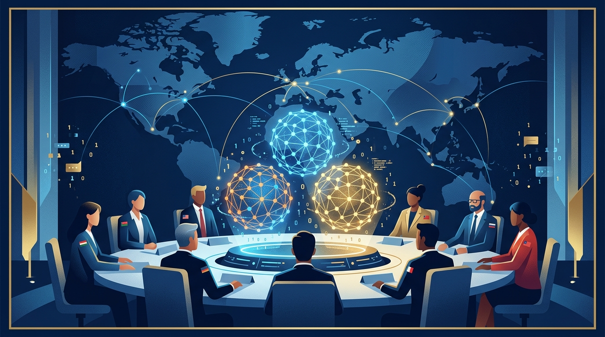

La IA se volvió, oficialmente, asunto de geopolítica dura. **DeepSeek**, el laboratorio chino que sacudió el mercado con sus modelos abiertos y baratos, se suma esta semana a **OpenAI** y **Anthropic** para informar al **Consejo de Seguridad de las Naciones Unidas** sobre los riesgos que plantea la inteligencia artificial, según reportó Reuters citando dos fuentes.

La sesión está programada para el miércoles y junta, en una misma mesa, a tres de los actores más observados del sector —dos estadounidenses y uno chino— justo cuando la tensión entre Washington y Pekín por el control tecnológico está al rojo vivo.

El punto de fondo no es menor: por primera vez la discusión sobre seguridad de la IA escala al órgano de la ONU que se ocupa de la paz y la seguridad internacional, no solo de foros técnicos o comités de ética. La señal es clara — los gobiernos ya tratan los modelos frontera como un tema de seguridad nacional y quieren a los propios laboratorios en la sala.

Para los que seguimos el día a día de los lanzamientos, esto cambia el tablero. Ya no se trata solo de quién saca el mejor benchmark o el modelo más barato. La narrativa de los próximos meses va a estar cruzada por regulación, coordinación internacional y la pregunta incómoda de si la carrera por la AGI debería tener frenos consensuados.

La presencia de DeepSeek es lo más llamativo: un laboratorio chino sentado a informar al Consejo de Seguridad de la ONU sobre riesgos de IA es un hito simbólico, y deja en evidencia que la influencia en este tema ya no es monopolio de Silicon Valley. Habrá que ver qué sale de la reunión — pero que estén los tres juntos ya es noticia en sí.

### Update: 2026-09-23

La sesión se concretó tal como estaba agendada. **OpenAI publicó oficialmente las declaraciones de Sam Altman ante el Consejo de Seguridad de la ONU**, bajo su categoría de Global Affairs. El simple hecho de que los laboratorios estén publicando formalmente sus intervenciones ante el órgano de seguridad de la ONU confirma lo que se venía venir: la gobernanza de la IA dejó de ser un tema de foros técnicos y se instaló, de lleno, en la agenda de paz y seguridad internacional. Queda la señal de que la discusión que antes corría en papers y benchmarks ahora se juega en las salas donde se toman decisiones geopolíticas de fondo.
