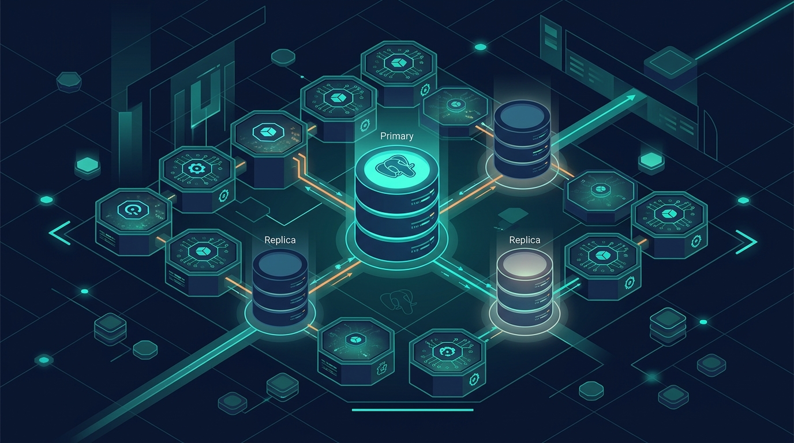

Correr PostgreSQL en Kubernetes ya era viable, pero el ecosistema de soporte comercial acaba de dar un salto. **Percona**, el conocido proveedor de software open-source para bases de datos, anunció hoy soporte para **CloudNativePG (CNPG)**, el operador de Kubernetes para PostgreSQL que se ha consolidado como el estándar de facto para manejar Postgres en clústeres.

La jugada es directa: Percona históricamente empujaba su propio operador (Percona Operator for PostgreSQL, basado en Patroni), y ahora abre la cancha para acompañar a quienes eligieron CNPG. Con esto, las empresas que ya corren PostgreSQL en Kubernetes con CNPG pueden contratar el soporte experto, consultoría y servicios de Percona sin tener que migrar a otro operador.

¿Por qué importa? CNPG ganó tracción enorme porque es liviano, cercano a la distribución oficial de PostgreSQL y no mete capas extra de complejidad. Sumar a un proveedor de soporte reconocido como Percona valida esa apuesta y le da a los equipos de plataforma una opción más para el "¿quién me responde si se cae la base a las 3 AM?".

El anuncio encaja con un patrón que venimos viendo: las bases de datos stateful dejaron de ser el tabú de Kubernetes. Operadores como CNPG (y el respaldo comercial que ahora llega) están bajando la barrera para mover cargas de producción reales al clúster, no solo stateless apps.

Ojo con el detalle: esto no significa que Percona abandone su propio operador. La lectura más razonable es que quieren cubrir ambos lados del mercado y no pelear contra la corriente. Para quien ya usa CNPG, es pura ganancia: más opciones de soporte, sin lock-in.
