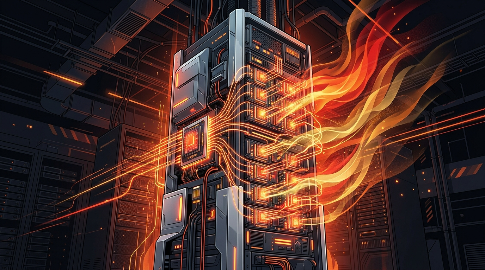

AMD acaba de cruzar una marca histórica: **superó el billón de dólares en capitalización de mercado** por primera vez, convirtiéndose en el cuarto fabricante de chips en ese club junto a Nvidia, Broadcom y Micron.

## Los números detrás del hito

El rally fue violento: **24% de subida en una semana**, cerrando sobre el billón el 21 de septiembre. Y no es humo:

- **Ingresos de data center: $6.700 millones en Q2**, un salto de 107% año contra año.
- La CEO **Lisa Su** apunta a la demanda del **sistema Helios**, que recién empieza a despacharse.

## Qué es Helios

Helios es la apuesta grande de AMD para competir de tú a tú con Nvidia en el entrenamiento de modelos de frontera. Cada sistema agrupa **72 aceleradores Instinct y 18 CPUs EPYC**, y ya lo están desplegando los principales labs de IA e hyperscalers.

La jugada es clara: Nvidia domina el *training* con sus GPUs, pero AMD quiere su tajada del pastel ofreciendo una alternativa de cómputo denso que los labs puedan escalar sin depender de un solo proveedor.

## La lectura

El contexto macro le da más peso: hay nerviosismo (y optimismo) sobre si la inversión en IA es una burbuja, con bancos centrales advirtiendo sobre los data centers y la inflación. Pero mientras los hyperscalers sigan firmando cheques por racks de Helios, AMD va a seguir subiendo.

Para los que trabajan en infraestructura, la señal es simple: **el cómputo de IA se está diversificando**. Ya no es solo "compra Nvidia o nada". Tener un segundo proveedor serio es buena noticia para los presupuestos y para la capacidad de negociar.

**Fuente:** The Motley Fool, AI Weekly (22 sep 2026).
