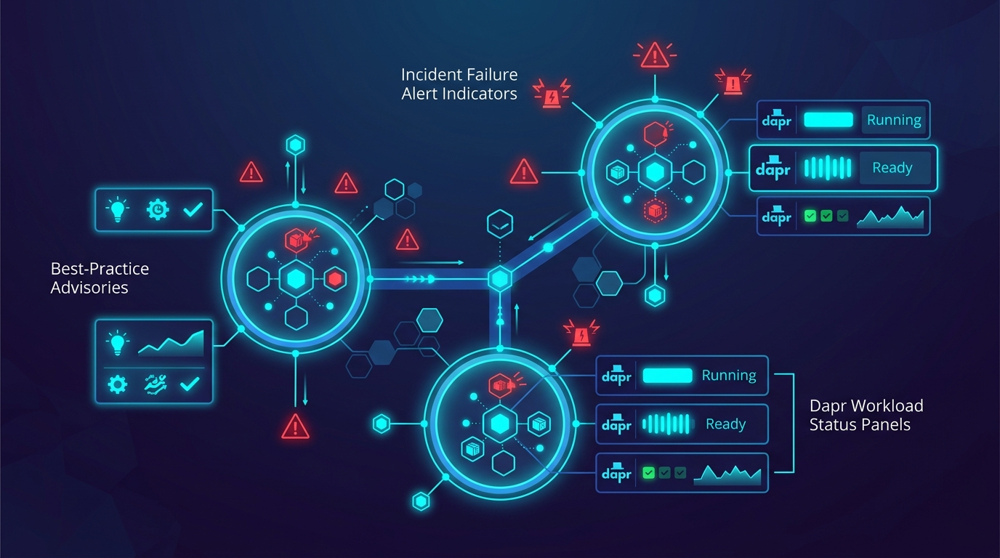

Diagrid, la empresa detrás de Dapr (el Distributed Application Runtime ya graduado en la CNCF), anunció que su **Dapr Ops Dashboard queda gratis para todos los equipos**. Se acabó el paywall: todas las funciones que antes pedían plan pagado ahora están disponibles sin tarjeta de crédito y sin período de prueba.

## Qué se libera

- **Operaciones a nivel de clúster**: gestión directa de las workloads Dapr.
- **Advisories de buenas prácticas**: recomendaciones proactivas para mantener las apps sanas.
- **Alertas de fallos de incidentes**: notificaciones cuando algo se cae.
- **Gestión multi-clúster**: ver y manejar varios clústeres desde un solo lugar.

## El contexto

Dapr es un proyecto ya **graduado en la CNCF** que corre en producción en miles de empresas, así que no es un juguete: es la capa de runtime distribuido para workflows mission-critical y agentes de IA autónomos. Diagrid, que también está detrás de la ejecución durable de agentes (su línea Catalyst), acaba de bajar la barrera de entrada a su capa de operación.

## La lectura

El movimiento huele a estrategia de aterrizaje y expansión clásica: regalar el dashboard de operación para que más equipos adopten Dapr en producción, y después monetizar con los niveles enterprise de la plataforma (Conductor, Catalyst, soporte). Para equipos que ya corren Dapr, es básicamente una herramienta gratis que antes costaba. Para los que están evaluando migrar de un mesh o de microservicios crudos a un runtime distribuido, le quita una excusa más.

**Fuente:** AiThority.
