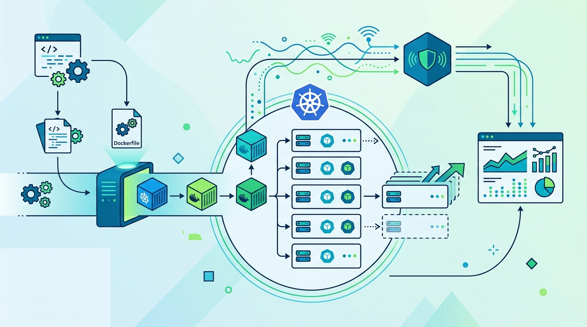

AWS le sumó un **Cluster Mode** a Elastic Beanstalk: ahora puedes correr tus apps como contenedores sobre **clústeres Amazon EKS** que el propio servicio crea y opera. Se instala al lado del tipo de entorno basado en EC2 (ahora rebautizado "Beanstalk Standard") y mantiene los mismos conceptos de aplicación, versión y entorno.

## Cómo funciona

- Las apps llegan como **código fuente, Dockerfile o imagen en ECR**; el código se construye con **Cloud Native Buildpacks** en AWS CodeBuild dentro de tu cuenta.
- Los nodos vienen de **EKS Auto Mode** y la observabilidad es **OpenTelemetry-based**.
- Los entornos de una misma cuenta que usan el mismo set de subnets VPC **comparten clúster**; un set distinto de subnets crea otro, en unos diez minutos.

## La letra chica (que el anuncio no dice tan fuerte)

InfoQ le saca el barro a la documentación y aparecen varios límites:

- **No eliges el clúster** ni su versión de Kubernetes. Tampoco puedes cambiar las subnets ni los IAM roles de un entorno existente: si te equivocas, toca recrear.
- **Acceso directo al clúster no existe**: todo es service-managed, vía API de Elastic Beanstalk, CLI o consola.
- **Opciones de deployment más angostas**: el blog habla de inmutable y traffic-splitting, pero la arquitectura documenta rolling update (default) o all-at-once. Lo inmutable sigue siendo de Beanstalk Standard.
- **Drift de configuración**: si cambias el clúster por fuera, el servicio lo detecta, deja de mantenerlo y no coloca entornos nuevos ahí hasta revertir.

## La lectura

Cluster Mode es para equipos que manejan un **portafolio de apps sobre infraestructura compartida** y quieren la simplicidad de Beanstalk sin administrar EKS a mano. El trade-off es la cesión de control: no tocas el clúster, no eliges versión y salir implica recrear. AWS lo vende con la promesa de que "puedes retomar el control de tus recursos si lo necesitas", pero por ahora la salida no es trivial. Buena jugada para sacarle la fricción de Kubernetes a los equipos chicos; los que ya dominan EKS probablemente no miren atrás.

**Fuente:** InfoQ, AWS News Blog.
