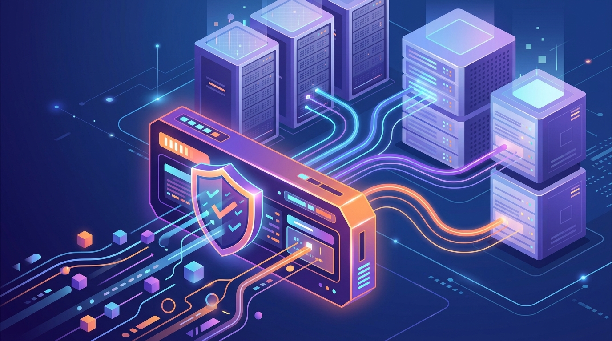

Fastly quiere ser el "control plane" del tráfico de IA que pasa por el edge. La compañía lanzó **AI Runtime Control**, **AI Firewall** y capacidades reforzadas de **API Security**, apuntando al mismo dolor: las empresas ya están en producción con IA, pero sin control de gasto ni de seguridad en tiempo real.

## Por qué ahora

Los números que cita Fastly para justificar el lanzamiento:

- El **tráfico generado por máquinas superó el 50%** de su red global en julio y agosto de 2026.
- El tráfico de IA creció **6,5 veces más rápido** que las peticiones humanas entre enero y mayo de 2026.
- Según McKinsey, el **93% de las organizaciones ya se está pasando del presupuesto asignado a IA**.

Traducción: la IA dejó de ser un piloto y la factura + el riesgo se están saliendo de control.

## Las tres piezas

**AI Runtime Control** — Gobierno de acceso y uso. Consolida las llamadas a modelos en un solo endpoint de edge (público o self-hosted). Usa *virtual keys* para no exponer las credenciales reales de los proveedores, y trae tracking de gasto de tokens en tiempo real, rate limiting, topes de presupuesto y **failover automático** entre modelos para no quedar pegado a un solo proveedor.

**AI Firewall** — Protección de aplicaciones de IA. Inspección de amenazas *inline* en el borde para mitigar vulnerabilidades de LLM, incluyendo **prompt injection**, evaluando los prompts en el mismo request path antes de que lleguen al modelo.

**API Security** — Extiende la protección a los agentes autónomos que consultan APIs corporativas.

## La lectura

La cita de **Kelly Shortridge** (CPO de Fastly) resume el ángulo: llevar el control en tiempo real que ya existe para CDN y seguridad de software, ahora hacia "los modelos, aplicaciones y agentes que definen esta nueva era de sistemas distribuidos".

Es el mismo movimiento que están haciendo Cloudflare, los hyperscalers y los vendors de observabilidad: el punto de control del gasto y la seguridad de la IA se está moviendo del código de la aplicación hacia **el request path**. Quien ve el tráfico, manda.

**Fuente:** Fastly / IT Digest.