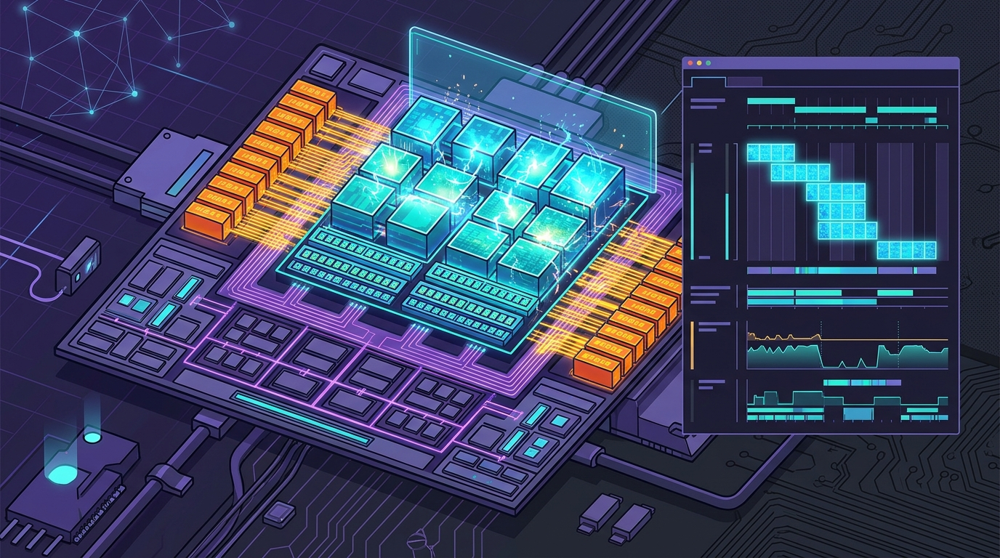

Google agregó un **Kernel Profiling suite** a **XProf**, su profiler open source para cargas de trabajo en TPU. La novedad: ahora se puede ver **detalle a nivel de ciclo** dentro de kernels custom escritos en **Pallas**, algo que antes aparecía como un bloque opaco en las capturas de trace.

## El problema que resuelve

El hueco viene de cómo los profilers tratan las rutas de compilación custom. Los kernels hechos con **Pallas, Mosaic o Triton** se saltan los passes estándar de XLA, lo que distorsiona los modelos de costo estático. El resultado: métricas como "optimal FLOPs" o la eficiencia de goodput pueden ser imprecisas, o derechamente no funcionar.

En palabras de Yogesh SY, del equipo de AI Infra de Google: un análisis estático puede marcar un bloque de instrucciones MXU como "totalmente utilizado" cuando en realidad la unidad está **ociosa esperando a HBM**, porque el análisis estático ignora el tiempo.

## Ciclo a ciclo, en la práctica

En **TPU v7 (Ironwood)**, XProf muestrea contadores de rendimiento de hardware en runtime. El ejemplo que da Google es contundente: en un matmul con tiling, encontraron un **memory stall** y, agregando triple buffering, recortaron el tiempo del kernel de **125.5 µs a 88 µs**, casi un **30% de mejora**.

El suite funciona en tres niveles: inspección del compilador (con flags como `--xla_enable_custom_call_region_trace=true`), perfilado de memoria y perfilado por ciclo de los kernels custom.

## Por qué importa

A medida que más equipos tunean kernels a mano para exprimir TPUs (y GPUs), la observabilidad fina deja de ser un lujo. Poder ver dónde se pierde el ciclo exacto —un stall de memoria, un MXU esperando— es la diferencia entre optimizar a ciegas y optimizar con evidencia. Para cualquiera metido en infraestructura de IA, este es un paso bien concreto hacia perfiles más honestos.
