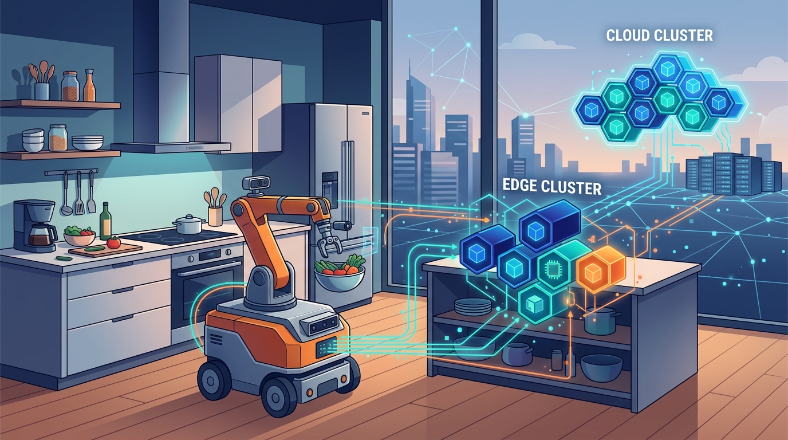

La robótica con IA siempre chocó con el mismo muro: la GPU que un robot puede cargar (y alimentar con batería) es chica. **Microsoft Research** acaba de abrir una puerta para saltarse ese límite: su **Physical AI Toolchain**, open source, ahora permite mover la inferencia del robot hacia **GPUs de edge o de nube**.

## Cómo funciona

La jugada es empaquetar las cargas de IA del robot en contenedores y repartirlas entre el robot, GPUs de edge y recursos en la nube. El desarrollador decide qué se descarga y qué corre a bordo, y un **tooling basado en Kubernetes** se encarga del placement y la gestión del resultado.

Esto convierte la decisión de "dónde corre el modelo" en algo que ya no está limitado por el hardware onboard, sino por la red y la capacidad de GPU remota disponible.

## Lo que midieron (y duele)

Microsoft hizo un estudio de medición sobre manipulación móvil —el clásico "encuentra la basura en la cocina y bótala" — comparando setups onboard, edge y nube. Los resultados le ponen números al límite de las GPUs chicas:

- **Mapeo y planificación** hasta un **383% más lentos** que en una A100.
- **Detección de obstáculos** cayó un **30%**.
- Los modelos visión-lenguaje-acción más lentos perdieron hasta **50% de precisión**.
- Pero la descarga **alargó la batería** en un setup con Raspberry Pi 5.

O sea: la ganancia no es que "la distancia haga más rápido al robot", sino que una GPU más potente, usada a tiempo, puede hacer más. El trade-off real es la conexión con el procesador remoto.

## Lo que trae la caja

- Ejemplos para los robots **SO-101** y **UR10e**.
- Integración con simuladores, **LeRobot** y **ROS2**.
- Una demo del modelo **Rho** controlando un robot **Mobile ALOHA** con la inferencia corriendo en una GPU **Jetson Thor**.

## La lectura

Esto mueve la robótica física al mismo patrón que ya vimos con los LLM: el cómputo pesado vive en el borde o en la nube, y el dispositivo se vuelve liviano. Kubernetes como capa de orquestación para cargas de robótica es la señal que importa acá: la "edge" deja de ser un rincón y pasa a ser un nodo más del clúster.

**Fuente:** Microsoft Research / Superpower Daily.