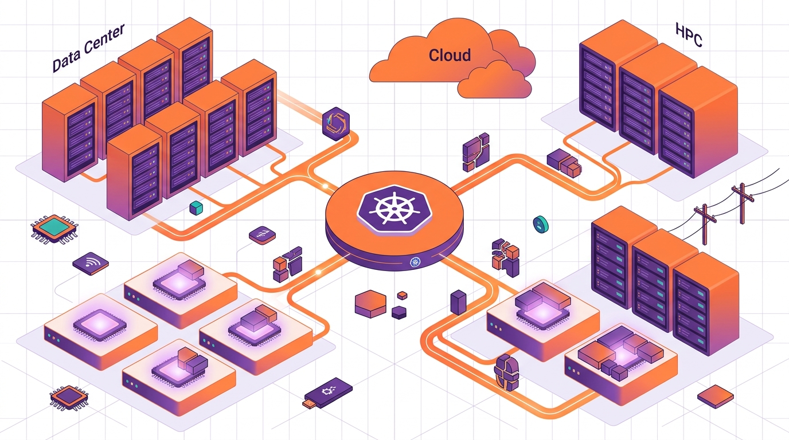

Nutanix anunció la compra de **Ryax Technologies**, una firma francesa de orquestación de cómputo y scheduling de workloads impulsado por IA, por un monto no revelado. El plan: integrar su tecnología de utilización de GPU y scheduling inteligente en las próximas versiones de **Nutanix Kubernetes Platform (NKP)** y **Nutanix Enterprise AI (NAI)**.

## El problema que ataca

Las GPUs están escasas y caras, y las cargas de IA viven repartidas entre data centers privados, hyperscalers, neoclouds y clústeres HPC. La mayoría de los entornos Kubernetes todavía asigna aceleradores con **reservas estáticas de dispositivo completo**, o sea, GPU entera o nada. Ryax trae:

- **Right-sizing guiado por telemetría**: dimensionar la GPU según lo que de verdad se usa.
- **Bin-packing fraccional de GPUs**: meter varias cargas en una misma GPU.
- **Lógica de placement costo-consciente**: decidir dónde corre la carga según costo, no solo según dónde hay GPU libre.

## Quién es Ryax

Fundada en 2017 en Francia por ex-Bull/Atos, con una década de R&D en torno a **Slurm** (el scheduler HPC). Ese pedigree de gestión de recursos HPC es justo lo que Nutanix quiere meterle a su capa de Kubernetes. Originalmente una plataforma de ingeniería de datos, Ryax se reconvirtió en un orquestador open source de workflows híbridos para bajar el costo de correr apps de IA y LLM.

## La lectura

Es un tuck-in chico pero con peso estratégico: mueve a Nutanix de "operar infraestructura de IA" a "decidir dónde y cómo corren las cargas de IA", un punto de control que **NVIDIA, Red Hat y los hyperscalers** están disputando a cara de perro. Con las GPUs como el recurso más peleado del mercado, el que controle el scheduling eficiente controla la factura. Nutanix acaba de comprar asiento en esa mesa.

**Fuente:** NAND Research.
