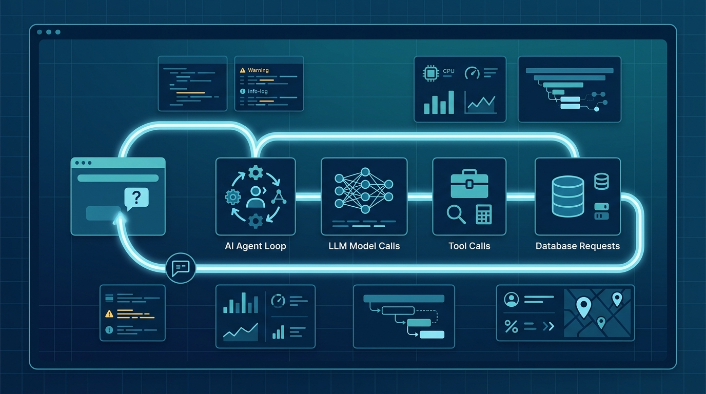

OpenObserve, la plataforma de observabilidad open source, acaba de anunciar la **disponibilidad general de su v1.0**, tanto para despliegues self-hosted como para OpenObserve Cloud. El titular es claro: la **observabilidad de IA** deja de ser una herramienta aparte y se suma al mismo lugar donde ya conviven logs, métricas, traces y real user monitoring (RUM).

## La tesis: un solo flujo de punta a punta

La idea de fondo es que la observabilidad de agentes "nunca iba a funcionar como una herramienta separada", como dice Prabhat Sharma, CEO de OpenObserve. Los agentes hablan con tus bases de datos, tu backend y tus usuarios, así que lo lógico es seguir una sola request desde el navegador, pasando por el loop del agente, la llamada al modelo, el tool call y la base de datos, sin andar cosiendo herramientas a mano.

## Qué trae la observabilidad de IA

- **Tracing de agentes**: seguimiento de sesión completa, incluyendo tool calls, requests a base de datos y latencia por paso.
- **Monitoreo de LLMs**: tracking de costos y uso de tokens, activado por defecto, con atribución por agente en más de 80 providers, frameworks y librerías.
- **Evaluación integrada**: scorers custom, jobs de eval programados, LLM-as-judge y colas de anotación que alimentan la siguiente ronda de evaluaciones.
- **Agent Graph y Agent Behavior**: para mapear las interacciones del agente y detectar dónde se rompe un loop.

## El resto de la v1.0

Además de la parte de IA, el release trae una **Alert Library con más de 1.200 alertas curadas**, alertas compuestas y de SLO burn-rate con export a Terraform/OpenTofu, monitoreo de bases de datos, synthetic monitoring open source y un PromQL más rápido.

## La lectura

El dato que suelta theCUBE Research es duro: el 93% de las empresas está construyendo agentes de IA propios, pero solo una de cada cinco tiene gobernanza madura. Ahí está el hueco que OpenObserve quiere tapar: conectar comportamiento del agente, output del modelo, telemetría de la app y contexto operacional en un solo plano. Para equipos que ya usan OpenObserve por su costo, sumar agentes sin abrir otra herramienta es una jugada lógica. La pelea por ser "el Datadog de la era de los agentes" sigue abierta.

**Fuente:** Business Wire, AiThority.
