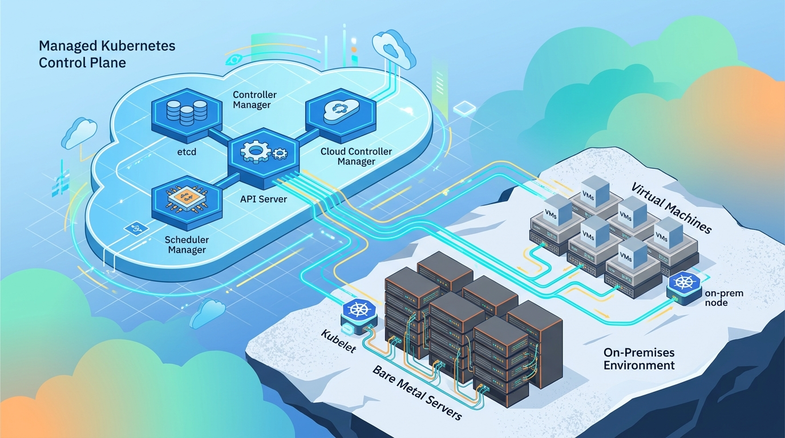

Microsoft sumó **Flex Nodes a Azure Kubernetes Service (AKS)**, y es de esas features en preview que dan que hablar. La idea corta: puedes **conectar tus propias máquinas virtuales y hosts bare metal a un clúster AKS administrado** y correrlos como nodos reales de Kubernetes, sin que esas máquinas se conviertan jamás en un node pool estándar de AKS.

## Qué resuelve

Si alguna vez te faltó cómputo de AKS en la región correcta, con el hardware correcto o con la latencia correcta, acá está la respuesta. Flex Nodes te deja usar infraestructura híbrida y de edge como **nodos worker conectados al plano de control de AKS en Azure**.

Los casos de uso típicos:

- **Edge y on-premise**: correr workloads cerca de donde están los datos.
- **Hardware especializado**: GPU o máquinas que AKS no ofrece en ciertas zonas.
- **Hybrid cloud**: aprovechar capacidad propia sin renunciar a la gestión de Azure.

## Cómo funciona

A diferencia de un node pool tradicional, donde AKS aprovisiona y controla las VMs, acá el **flex host** es tuyo: lo levantas como una VM de Azure (o bare metal), lo registras y el clúster lo adopta como nodo. El plano de control sigue siendo administrado por Microsoft, pero el cómputo vive afuera.

La movida es interesante para equipos de plataforma que llevan tiempo pidiendo una forma limpia de mezclar capacidad propia con la comodidad de AKS. Todavía está en preview, así que no hay SLA ni soporte productivo garantizado, pero el roadmap apunta directo a híbrido y edge sin dramas.

**Fuente:** Pixel Robots (recorrido completo con un flex host en una VM de Azure), vía docs de AKS.
