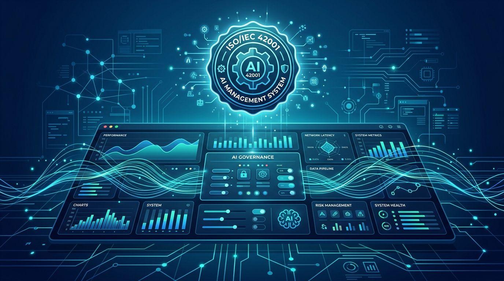

La confianza se está volviendo el verdadero cuello de botella de la IA en la empresa. **Dynatrace** lo entendió y acaba de anunciar que obtuvo la certificación **ISO/IEC 42001:2023**, el primer estándar internacional para sistemas de gestión de inteligencia artificial (AIMS, por sus siglas en inglés).

¿Qué significa en concreto? Que la certificación cubre los sistemas de gestión de IA que soportan la plataforma de Dynatrace, incluyendo las capacidades impulsadas por IA que la compañía desarrolla e integra en **Dynatrace SaaS** y **Dynatrace Managed**. El certificado fue emitido por **Schellman Compliance, LLC** (número 1395170-1), con vigencia desde el 2 de septiembre de 2026 y válido hasta el 1 de septiembre de 2029.

El detalle técnico que importa: ISO/IEC 42001 no certifica un modelo ni una afirmación de marketing, sino el **sistema de gestión detrás de la IA** — cómo una organización gobierna la IA, evalúa riesgos e impacto, gestiona los datos de los que depende y mantiene a humanos responsables de los resultados, a lo largo de todo el ciclo de desarrollo.

Para los equipos de plataforma y SRE esto tiene una lectura práctica. En industrias reguladas (banca, salud, gobierno), la adquisición de herramientas con IA incorporada ya no se decide solo por features: los equipos de seguridad, riesgo y compliance preguntan cada vez más por la gobernanza del proveedor. Una certificación independiente como esta les da una respuesta auditable y reconocida internacionalmente, y promete agilizar el due diligence a la hora de adoptar IA a escala.

La jugada de Dynatrace también manda una señal al resto del mercado de observabilidad: en plena ola de agentes de IA y "AIOps", la diferenciación ya no va a estar solo en quién correlaciona más señales, sino en quién puede demostrar que su IA opera bajo un sistema de gestión responsable y auditado de forma continua — no en un solo punto en el tiempo.
