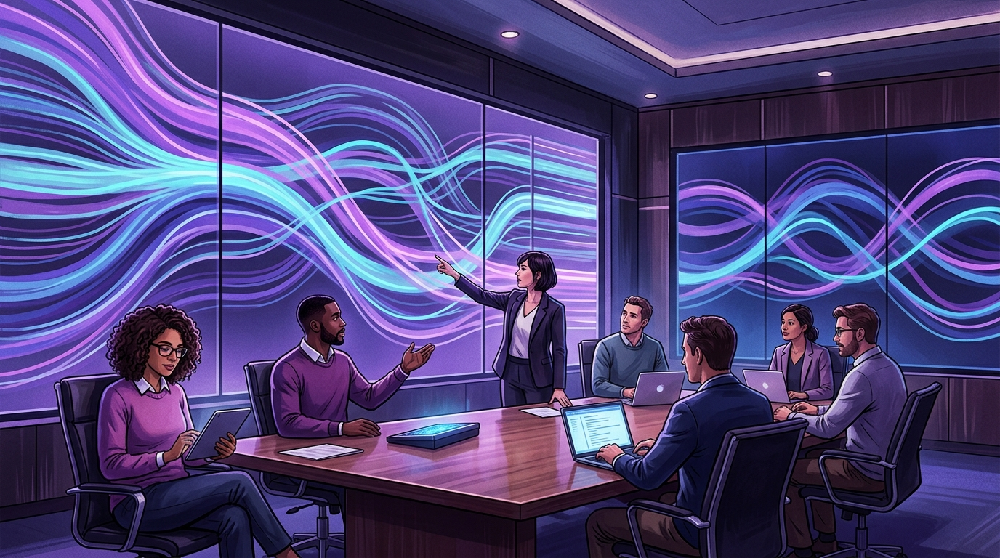

El **9 de noviembre de 2026**, en Salt Lake City, vuelve el **Observability Day** como evento co-ubicado de KubeCon + CloudNativeCon North America, juntando a maintainers, operadores y usuarios finales de la comunidad observabilidad de la CNCF.

Contexto: la observabilidad está en un punto de inflexión. **OpenTelemetry se graduó en CNCF en mayo de 2026**, los proyectos establecidos siguen evolucionando, y los equipos están aplicando estas tecnologías a desafíos nuevos: workloads de IA, costo de telemetría, escala y calidad de datos. Observability Day busca ser un espacio vendor-neutral donde maintainers y practicantes comparen enfoques y vean cómo responde el ecosistema.

El evento tiene historia: nació como **FluentCon** en KubeCon EU 2022 (Valencia), enfocado en Fluentd y Fluent Bit. Ese mismo año, el Open Observability Day amplió la convocatoria a Jaeger, Thanos, Prometheus y OpenTelemetry, sentando la base de lo que es hoy: un foro compartido donde las comunidades —y los que las combinan en producción— aprenden unas de otras.

El programa 2026 cubre:

- Internals de proyectos y arquitecturas cross-proyecto.
- Data engineering para hacer la telemetría útil y asequible.
- Áreas emergentes: observabilidad de agentes e IA, instrumentación eBPF, y telemetría de CI/CD y plataformas.

La idea de fondo: dejar de mirar cada proyecto por separado y entender cómo instrumentación, pipelines de telemetría, almacenamiento, correlación y operaciones encajan en un entorno cloud native moderno.
