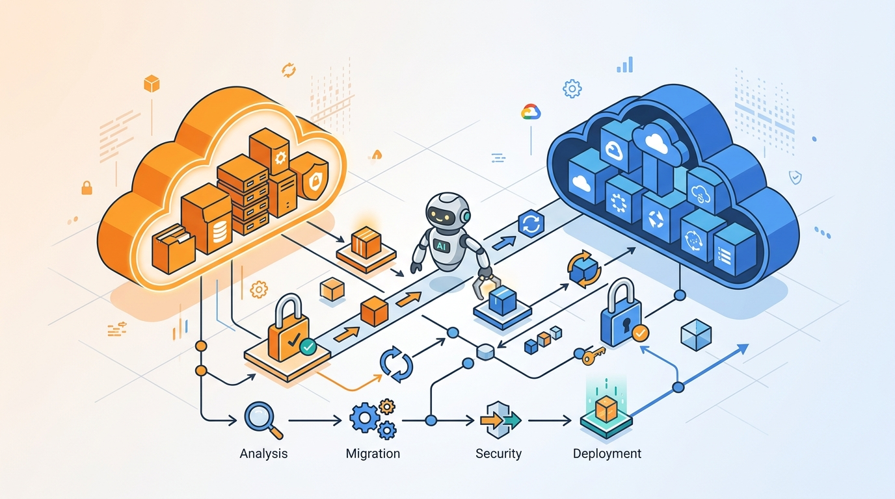

Migrar un entorno Kubernetes complejo de **AWS EKS a GKE** históricamente ha sido una pega brutal: disección manual de IaC, diferencias arquitectónicas entre nubes y scripts de traducción hechos a medida. Google viene a cambiarle la cara al asunto con **GKE agentic migration**, un **plugin de agente liberado en open source** que reemplaza el prompting ad-hoc con un **pipeline de migración asistido por IA y protegido por guardrails deterministas**.

## El problema del prompting suelto

Los equipos ya usan LLMs generalistas para redactar conversiones de infra, pero el atajo se convierte en trampa operacional. Los modelos crudos **alucinan propiedades de recursos inexistentes**, se les caen configuraciones de red o identidad, y pierden contexto entre archivos interdependientes. El tiempo que la gente gasta auditando y depurando los errores del modelo se come la ganancia inicial de velocidad.

## Qué trae GKE agentic migration

La propuesta de Google apunta a los tres dolores de gobernanza más repetidos:

- **Brecha de confianza en la automatización**: en vez de confiar en un modelo genérico, mete guardrails deterministas, persistencia de estado estructurada y límites de responsabilidad entre equipos de plataforma y de aplicación.
- **ClickOps contra el cluster vivo**: las herramientas legacy se conectan directo al cluster y despliegan por API, saltándose el repo Git, rompiendo CI/CD y haciendo rollbacks un infierno. Esta solución trabaja sobre Git como fuente de verdad.
- **Cuellos de botella en el handoff**: las migraciones son operaciones de semanas, y el traspaso entre platform engineers y devs suele ser un punto de fricción.

Un dato clave del anuncio: **human approval gates no negociables**. Nada se despliega sin que un humano dé el visto bueno. Rahul Shrivastava (EVP de Persistent) lo describe como una *"fábrica de migración de grado compilador"* que reduce el riesgo de ejecución.

## Por qué importa

Esto es un síntoma de hacia dónde va la migración de infra: de *"un LLM que te tira código casi correcto"* a **agentes con estado, guardrails y aprobación humana obligatoria**. Para equipos que arrastran deudas de migración entre hyperscalers, el mensaje es claro: el problema ya no es mover el código, es moverlo **sin romper la gobernanza**.
