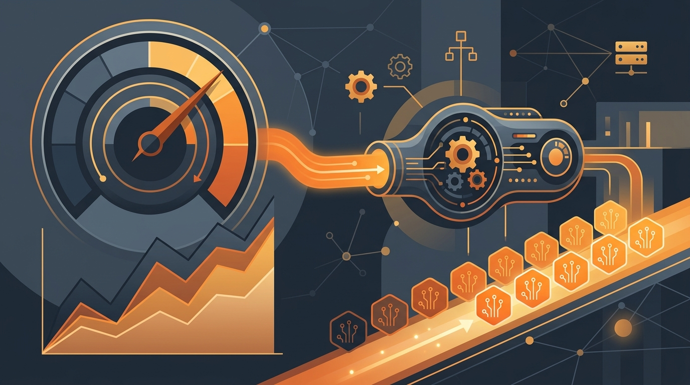

Google acaba de dar un paso interesante para los que viven peleando con el autoscaling en Kubernetes: **GKE ahora procesa métricas de Prometheus de forma nativa**, permitiendo que el Horizontal Pod Autoscaler (HPA) escale usando consultas **PromQL** directo, sin adapters de terceros.

## El problema de siempre

A principios de año GKE ya había anunciado soporte nativo de *custom metrics* a nivel de pod, eliminando la necesidad de adapters externos y bajando la latencia de lectura de métricas a ~5 segundos. Pero las cargas de producción suelen necesitar escalar sobre métricas de infraestructura más complejas, como:

- Un pool de workers según la cantidad de mensajes sin procesar en un tópico de Pub/Sub.
- Un servicio de inferencia según QPS (consultas por segundo) guardado en Cloud Monitoring o Prometheus.
- Una granja de servidores web según el percentil 95 del tiempo de respuesta.

Hasta ahora, para eso había que montar el **Stackdriver Custom Metrics Adapter** o el **Prometheus adapter**, lo que traía fricción operacional: overhead de instalación y parcheo, puntos de falla en el loop de autoscaling, y complejidad de IAM con mapeo de service accounts.

## Qué cambia

Extendiendo el objeto **AutoscalingMetric**, ahora el HPA puede leer métricas directamente desde **Cloud Monitoring** usando **Google Managed Service for Prometheus**, sin componentes intermedios. Los puntos clave:

- **Sin mantenimiento de adapters**: todo el ciclo de vida está gestionado dentro de GKE.
- **Seguridad simplificada**: el *Kubernetes Default Node Service Agent* ya tiene permisos de lectura sobre Cloud Monitoring y Google Managed Prometheus en el mismo proyecto. Nada de service accounts extra, keys ni federación.
- **Baja latencia**: el sistema de AutoscalingMetric consulta el backend cada **15 segundos**.
- **Consultas ricas**: puedes usar todo el poder de PromQL (rates, promedios, percentiles) para traducir objetivos de negocio en reglas de escalado.
- **Eficiencia de recursos**: el controller corre en el control plane y solo despliega el pod del sistema cuando hay una métrica PromQL activa; si no hay métricas configuradas, se apaga y no consume nada.

## Integración con scale-to-zero

Un detalle que amarra con el anuncio reciente de GKE: el soporte de métricas Prometheus se integra con la **capacidad de scale-to-zero** del HPA, y para volver a subir rápido desde cero usa la **CapacityBuffers API**.

## Estado

El soporte nativo de métricas Prometheus está en **preview**. Google adelantó que planea soportar servidores Prometheus self-hosted cuando la feature llegue a disponibilidad general. Para los que quieran probarlo, la configuración es directa: defines el recurso `AutoscalingMetric` con tu consulta PromQL y lo referencias en el HPA con el formato `autoscaling.gke.io|<custom-resource-name>|<metric-name>`.

Para el que ya está en GKE, es una buena noticia: menos piezas que mantener y un loop de autoscaling más robusto y rápido.
