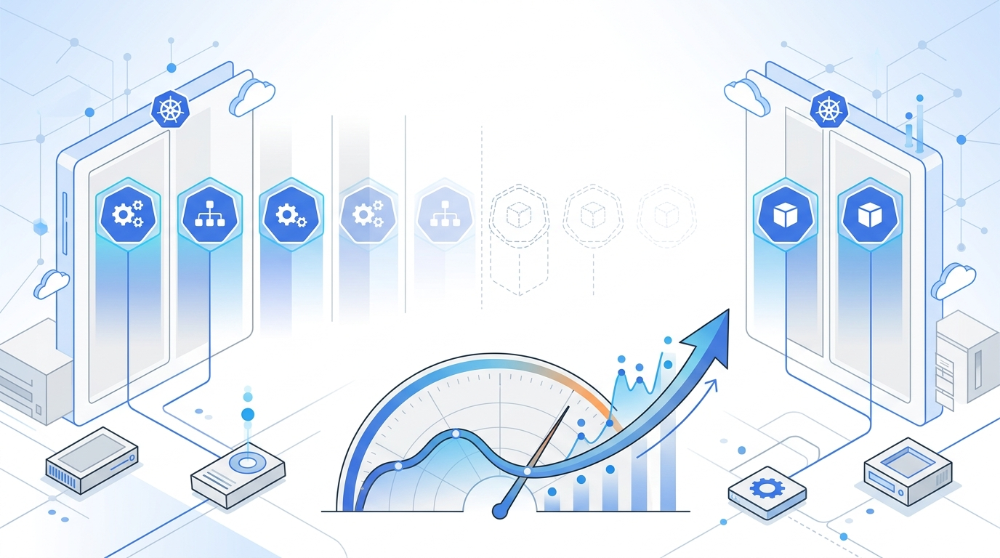

Google le pegó el palo al gato a uno de los dolores más viejos del cloud-native: las cargas de trabajo que corren de forma esporádica (batch, workers event-driven, entornos de desarrollo) pero que **siguen consumiendo cómputo mientras esperan pega**. En **GKE 1.37**, la respuesta es un **scale-to-zero nativo**, integrado directo en el control plane.

## KEDA era la solución, pero con costo

Hasta ahora, la salida clásica era **KEDA** (Kubernetes Event-Driven Autoscaling), un componente opcional. Funciona, pero suma fricción: hay que administrar CRDs tipo `ScaledObject`, operadores, y en flotas grandes la configuración puede pasar de las **10.000 líneas de YAML**. Sin mencionar la latencia extra que meten los polling intervals y los saltos entre componentes en el arranque en frío.

## Cómo funciona el scale-to-zero nativo

Google hornea la lógica directo en GKE, apoyándose en dos piezas:

- **HPA con AutoscalingMetric**: un pipeline de señales administrado que ahora lee métricas externas directo desde **Google Cloud Managed Service for Prometheus**, además de Pub/Sub, Cloud Monitoring y señales del Load Balancer, sin necesidad de un adaptador.
- **KEP-2021**: la mejora de Kubernetes que habilita `minReplicas: 0` en el HorizontalPodAutoscaler. Con esto, el HPA detiene todos los pods cuando la métrica cae bajo el umbral y los "despierta" apenas detecta trabajo pendiente.

La gracia es que la lógica pasa de ser un *sidecar management* a un **atributo nativo de la workload**.

## Por qué importa

Esto no es solo ahorrar plata. Es **desacoplar el costo de la infraestructura siempre encendida de la disponibilidad de la workload**. Equipos que corren procesos batch o workers que esperan eventos en una cola pueden llegar a cero réplicas sin miedo a perder la capacidad de reaccionar rápido.

El trade-off es claro: menos componentes que operar, menos YAML que mantener y arranques en frío más predecibles. Si estás en GKE y todavía arrastras KEDA para scale-to-zero, vale la pena revisar si el camino nativo te simplifica la vida.
