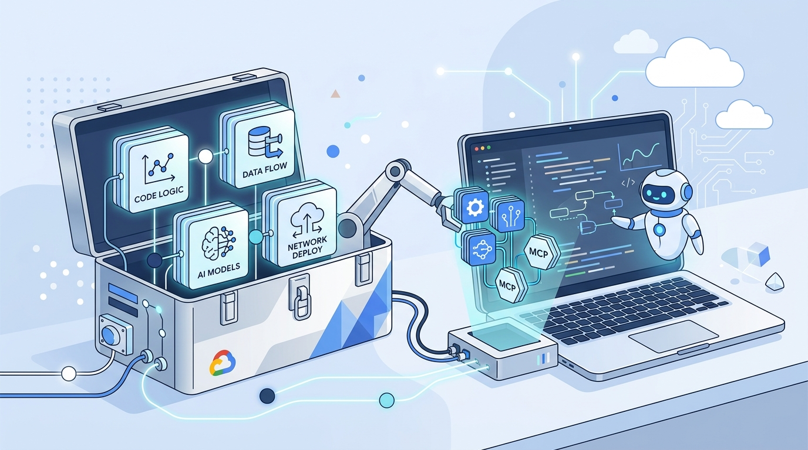

Google Cloud se sube a la ola de los **agent plugins** con un anuncio apuntado a los equipos que ya metieron agentes de IA en su día a día de código. La idea: empaquetar **skills, contexto y MCP servers** relacionados en **bundles instalables**, para que el agente sea más efectivo sobre Google Cloud sin pelearse con dependencias sueltas.

## El problema del acoplamiento de herramientas

Los agentes rinden mucho más cuando combinan varias skills en tándem, junto con contexto complementario y la capacidad de interactuar con un entorno vivo. Por ejemplo, un agente que analiza infraestructura se beneficia de tener a la vez conocimiento de dominio, recomendaciones de workflow y acceso al entorno real. Pero manejar cada skill por separado se vuelve inmanejable rápido.

Los **plugins** resuelven ese acoplamiento empaquetando capacidades relacionadas en bundles cohesivos.

## Qué incluye el lanzamiento

En el **Google Agent Skills repository** (g.dev/cloud/agent-plugins) van a ir apareciendo dos tipos de plugins:

- **Plugins fundacionales**: guía esencial de plataforma para descubrimiento de documentación, configuración de proyectos y diseño arquitectónico.
- **Plugins de dominio**: conocimiento y best practices especializados para áreas técnicas específicas dentro de Google Cloud.

El lanzamiento arranca con un **plugin fundacional** que cubre a todos los usuarios de Google Cloud, enfocado en hacer más fácil el arranque con agentes.

## Por qué importa

Los agentes de código están dejando atrás el modelo de *"un skill suelto por aquí, un MCP por allá"* para moverse a **distribución empaquetada de capacidades**. Es la misma lógica de los plugins en un editor, pero aplicada a los agentes: instalación simple, dependencias resueltas y combinación de skills con un objetivo común. Si ya estás armando tus propios agentes, vale la pena mirar cómo Google está estandarizando el empaquetado.
