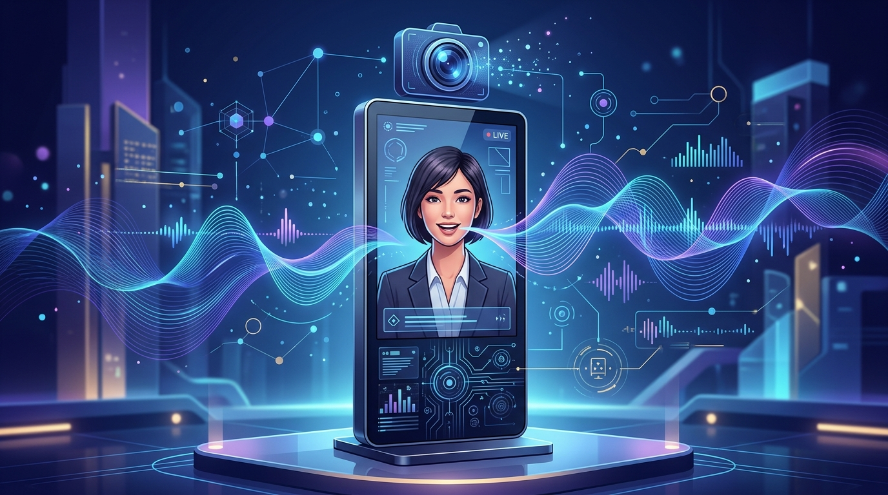

Google Cloud sigue empujando su apuesta por la voz y el video conversacional: **Gemini 3.8 Live con Live Avatar** pasó de preview a **disponibilidad general (GA)** en Gemini Enterprise. La tecnología se había mostrado por primera vez en Google Cloud Next 2026 y ahora está lista para producción enterprise.

Lo que trae:

- **Avatares de video**: Live Avatar genera avatares con sincronización labial para agentes de video conversacionales en web, móvil y kioscos interactivos. Los avatares personalizados siguen en allowlist.
- **Diálogo fluido**: voz-a-voz nativo, con recuperación natural de interrupciones sin perder contexto ni transacciones de backend.
- **Tool calling en vivo**: ejecuta herramientas y llamadas a API en segundo plano mientras sigue conversando.
- **97 idiomas**: entiende y habla 97 idiomas con detección automática.
- **Comprensión visual en vivo**: procesa feeds de cámara y screen sharing junto con el audio, al mismo tiempo.

El dato: **Gemini 3.8 Live Extended Thinking** se mantiene en preview privado. Y el foco de Google dejó de ser "más barato y rápido" para pasar a "interacciones de mayor calidad", con endpoints en EE.UU. y la UE, throughput provisionado y gobernanza de datos enterprise.

Para equipos de plataforma, esto abre la puerta a agentes de voz/video con presencia visual en canales de atención, sin armar la infra de streaming, STT y TTS por separado. El modelo hace todo nativo.
