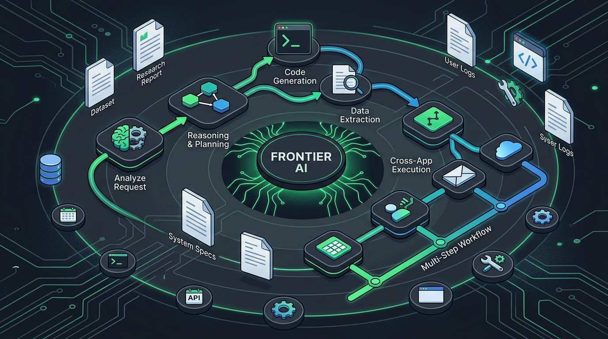

El siguiente capítulo de la IA enterprise no se trata de chatear: se trata de **trabajar contigo**. **GPT-6 Astra**, el modelo frontera más nuevo de OpenAI, entró a **disponibilidad general para todos los clientes de Microsoft Foundry**.

Qué lo distingue:

- **Planificación deliberada**: descompone un desafío abierto en pasos, evalúa opciones, comunica su recomendación y deja claras las próximas acciones.
- **Output pulido y con propósito**: aplica contexto, plantillas y estándares de calidad para producir documentos, planillas y presentaciones listas para revisión.
- **Ejecución entre aplicaciones**: con uso avanzado de herramientas y *computer use*, puede interactuar con software en nombre de la persona, moverse entre apps y completar tareas multi-paso con supervisión humana.

La apuesta de Microsoft es clara: Foundry junta identidad, networking, gobernanza, manejo de datos, evaluación y compliance para que los equipos pasen de experimentar a producción con velocidad y confianza. El mensaje repetido es que la fricción enterprise (gobernanza, seguridad, datos) es justamente lo que mata las iniciativas de IA, y Foundry pretende resolverlo de base.

Esto es la pieza que le faltaba al rompecabezas de la semana: OpenAI ya había rebajado GPT-6 Sol/Luna a la mitad, y ahora su flagship Astra aterriza en Azure para el mundo corporativo. La "guerra de modelos" se traslada del benchmark al escritorio.
