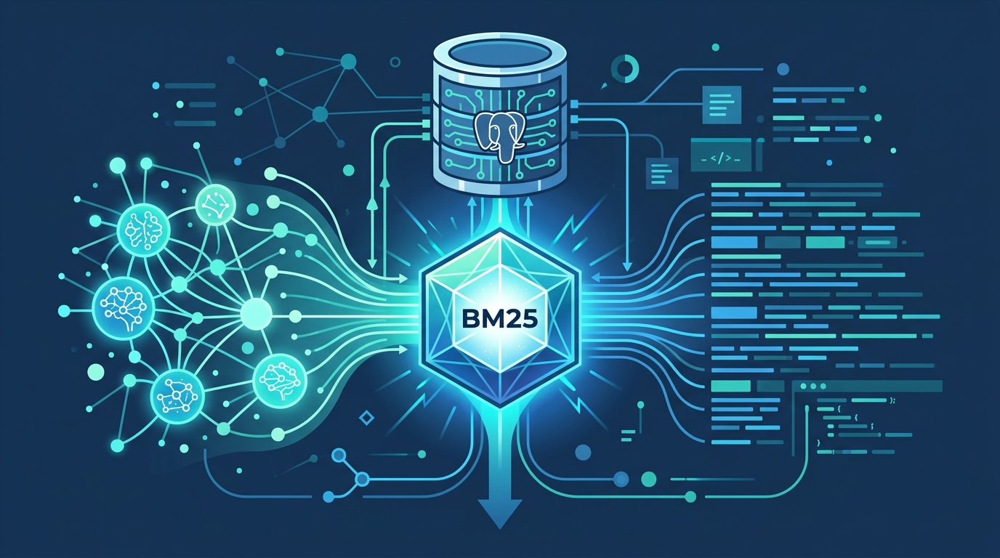

Google Cloud acaba de matar una de esas fricciones que todos dábamos por sentadas: hasta hoy, si querías búsqueda por ranking BM25 en AlloyDB o Cloud SQL, tenías que montar un backend de full-text search aparte. Eso significaba silos de datos, lag de sincronización y más piezas que mantener. Se acabó.

La novedad es un **índice BM25 nativo en AlloyDB y Cloud SQL para PostgreSQL 17+**, en preview, construido sobre la extensión open source `pg_textsearch` de Tiger Data.

## Por qué BM25 importa

El full-text search integrado de PostgreSQL (`ts_rank`) se queda corto cuando el corpus crece: no tiene inverse document frequency (las palabras comunes pesan igual que las raras), no hay saturación de frecuencia (repetir "base de datos" 50 veces no debería darte más ranking) y menos aún normalización de largo de documento. BM25 es el estándar de oro para retrieval y arregla todo eso.

## Híbrido es la jugada

Los embeddings entienden el significado ("árboles más altos que una casa"), pero se tropiezan con IDs alfanuméricos exactos y SKUs. Por eso el combo es **búsqueda semántica + keyword exacta**, fusionadas con Reciprocal Rank Fusion (RRF).

En AlloyDB sale de caja con una UDF de hybrid search; en Cloud SQL lo armas con CTEs. Y de yapa, AlloyDB suma hasta **6x–10x más velocidad en vector search** con los índices ScaNN y HNSW frente a PostgreSQL estándar.

**Fuente:** cloud.google.com.
