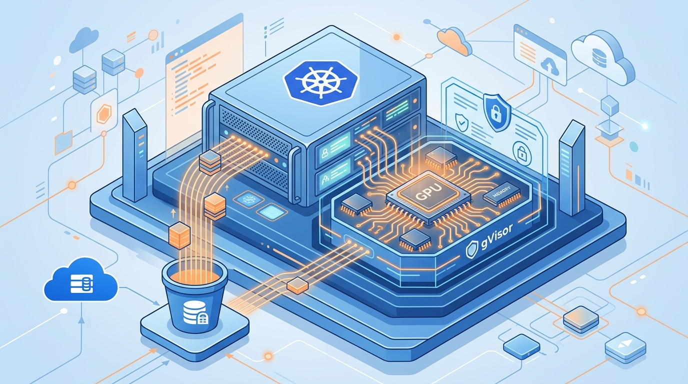

Google publicó los benchmarks de **Pod Snapshots en GKE**, y los números son de los que hacen ruido: hasta **89% menos latencia de arranque**, un modelo de **70B cargando en 37 segundos** y uno de 8B en 15. La gracia no es el caché clásico, sino checkpoint y restore: el snapshot congela todo lo que el proceso tenía vivo (file descriptors, threads, registros de CPU, memoria, filesystem del contenedor, volúmenes EmptyDir y tmpfs) y una réplica nueva arranca directo desde ahí.

El resultado práctico es que el pod **se salta la inicialización completa** que carga el modelo, que es justo donde se va la mayor parte del tiempo de arranque en modelos grandes.

## Cómo funciona por dentro

El que hace la magia es **gVisor**, y eso trae una condición: los pods tienen que correr en **GKE Sandbox**, que es donde vive ese runtime. Los clústeres Autopilot ya lo traen; los Standard necesitan un node pool con gVisor activado. Un agente en cada nodo maneja el ciclo de vida del snapshot, un controller en el control plane limpia los obsoletos y **Cloud Storage** guarda los datos.

La configuración se hace con dos custom resources: `PodSnapshotStorageConfig` (apunta al bucket) y `PodSnapshotPolicy` (elige pods por label, define el trigger —workload o manual— y la retención con `lastAccessTimeout` y un tope por grupo).

## El caso real que lo respalda

Codeway, con su plataforma Retake, tenía una capa de caché custom para artefactos compilados que dejaba el arranque en un minuto. Con Pod Snapshots lo bajaron a **"solo 8 segundos"**, y ahora levantan instancias H100 para un job específico y las apagan al terminar.

## La discusión que se abrió

La reacción de la comunidad se centra menos en la captura y más en lo que pasa después: la invalidación. Como los snapshots matchean por hash del spec, serie de máquina y versiones de kernel y drivers, la pregunta es si mantener esa consistencia no termina siendo el problema más duro que el propio snapshot. Es la discusión de fondo de cualquier técnica de caché: capturar es fácil, saber cuándo lo que tienes ya no sirve es lo difícil.

**Fuente:** InfoQ / cloud.google.com.
