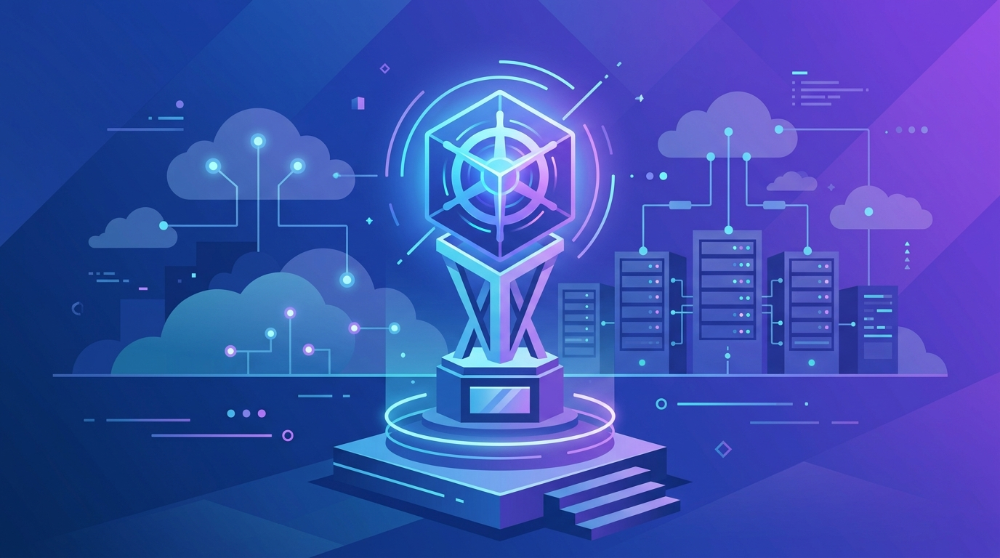

Gartner volvió a poner a Google en lo más alto del [Magic Quadrant de Container Management 2026](https://cloud.google.com/blog/products/containers-kubernetes/2026-gartner-magic-quadrant-for-container-management): **Líder por cuarto año consecutivo**, con la mejor posición en *Ability to Execute* entre todos los vendors evaluados.

En el reporte complementario de *Critical Capabilities*, Google Cloud se llevó el **primer lugar en todos los casos de uso**: aplicaciones cloud native nuevas, apps existentes containerizadas, entrenamiento de IA, inferencia de IA, edge e híbrido.

### El dato que nadie debería ignorar

Gartner proyecta que **para 2028, el 95% de los nuevos despliegues de IA van a usar Kubernetes**, subiendo desde menos del 30% en 2025. O sea, Kubernetes deja de ser una opción y se convierte en la capa de facto de la infraestructura de IA.

Google juega con la historia a favor: creó Kubernetes en 2014 y lanzó GKE en 2015, el primer servicio gestionado de Kubernetes. La apuesta de 2026 es llevar esa plataforma a la era *agentic*: GKE Autopilot, Cloud Run y una batería de features nuevos para correr workloads de IA a escala.

Para equipos de plataforma, la señal es clara: el container management ya no es un commodity, es donde se va a pelear la eficiencia de la próxima ola de aplicaciones con agentes.
