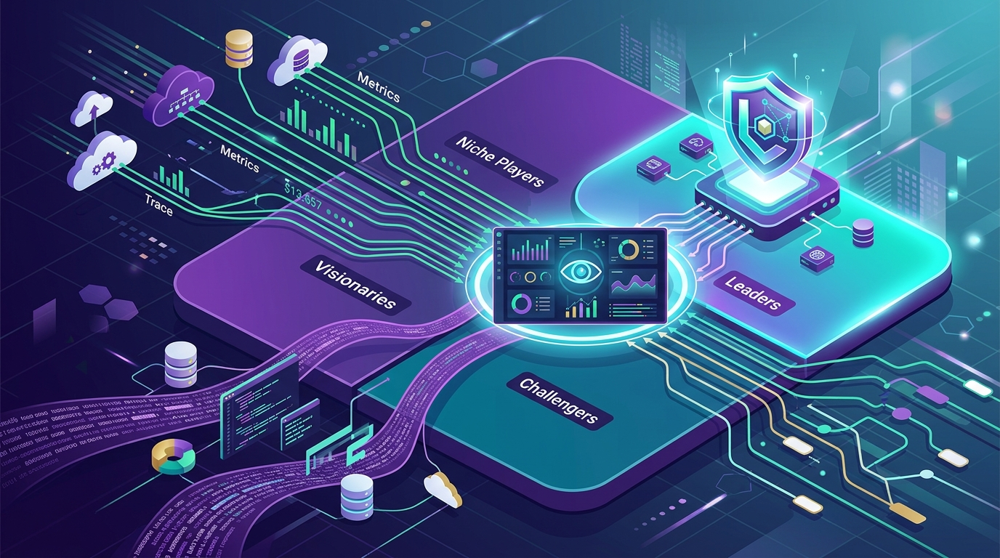

Grafana Labs anunció que fue posicionada como **Líder** en el **Magic Quadrant 2026 de Plataformas de Observabilidad** de Gartner. Es un reconocimiento relevante en un momento donde el mercado observability está convergiendo hacia plataformas abiertas y componibles, en lugar de suites cerradas.

El posicionamiento refuerza una tesis que Grafana viene empujando hace rato: que la observabilidad del futuro no es un monolito de un solo vendor, sino un stack **open source y componible** —Prometheus, OpenTelemetry, Loki, Mimir, Tempo y Grafana— que se integra con lo que ya tienes en producción.

## Por qué importa

El Magic Quadrant de Gartner es una de las referencias que los equipos de plataforma y los tomadores de decisión miran a la hora de evaluar proveedores de observabilidad. Que Grafana aparezca en el cuadrante de Líderes valida su apuesta por un modelo open core: el proyecto open source (con más de 20 millones de usuarios activos, según la compañía) como motor de adopción, y la plataforma cloud/managed como negocio.

Esto llega en un contexto donde la observabilidad dejó de ser solo "dashboards y alertas" y pasó a ser la capa sobre la que se miden los **agentes de IA** y los sistemas autónomos: sin telemetría de calidad no hay forma de confiar en lo que un agente hace en producción.

**Fuente:** grafana.com/blog.
