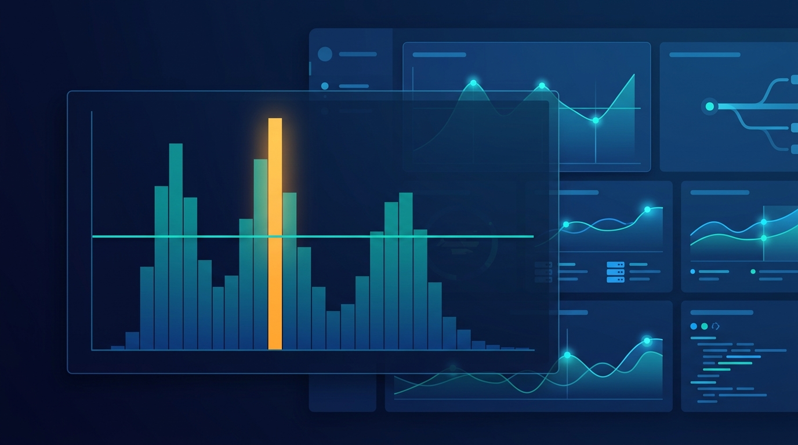

En P99 CONF —la conferencia dedicada a la métrica P99— el invitado estrella vino a decir, entre líneas, que **el P99 no basta**. Adrian Cockcroft, con décadas de arquitectura y escalado de sistemas en Sun, Netflix, eBay y Amazon, repasó en una charla con la analista de RedMonk Rachel Stephens cómo la IA cambió su forma de hacer ingeniería de rendimiento.

## Del vmstat al código fuente del kernel

Cockcroft recordó los viejos tiempos en Sun, cuando la gente miraba `vmstat` y "adivinaba" qué significaban los números. Su solución fue literal: **leyó el código fuente del kernel** y documentó exactamente de dónde salía cada número, qué significaba y cuáles aproximaban qué. De ahí salieron dos libros de referencia: *Sun Performance and Tuning* y *Resource Management*.

Cuatro décadas después, hay un montón de herramientas de tracing end-to-end, pero su curiosidad sigue en lo que las herramientas **no** muestran. "Todo se ve bien en las herramientas, pero el sistema no se comporta bien", dice, y su instinto es buscar una forma nueva de mirar los datos: análisis nuevo, mayor granularidad, o dejar de mirar promedios y mirar distribuciones.

## Picos, no percentiles

Su tesis central: los percentiles **no funcionan** para entender la latencia de los servicios web modernos. Un número único como el P99 no te dice si la distribución subyacente tiene un pico o varios. Y cuando hay más de un pico (algo común en producción), la media, la desviación estándar e incluso el P99 pierden significado.

El ejemplo clásico: un histograma con dos picos —uno rápido por un cache hit y otro lento por un miss que exige trabajo real. Si el cache hit rate cambia, cada pico mantiene su posición, pero las alturas suben y bajan. "Tus promedios y tu P99 cambian por todos lados, pero lo único que está pasando es que tu cache hit rate cambió".

Su respuesta: una herramienta que identifica **un número arbitrario de picos** en la distribución y sigue cómo fluctúan en el tiempo. Escrita en R —un lenguaje que no usaba hace años, pero que ChatGPT "conocía bastante bien"— y open source.

## Vibe coding para herramientas de análisis

Aquí entra la parte más interesante para 2026: Cockcroft confiesa que está **vibe coding** sus propias herramientas de análisis de anomalías. "Mi speedup es infinito, porque este código no existiría sin estas herramientas. No tendría tiempo de construirlas". Lo que antes implicaba repasar Python o cazar fragmentos de librerías gráficas en Stack Overflow, ahora lo levanta en minutos con un LLM.

Su consejo para equipos de alto rendimiento: empezar con la vista macro para encontrar lo interesante y luego ir bajando hasta inspeccionar requests individuales lentos de punta a punta. "Recuerda el microscopio que te regalaron de niño: primero enfocas a 10x, luego a 100x, luego a 1.000x".

**Fuente:** The New Stack (P99 CONF).
