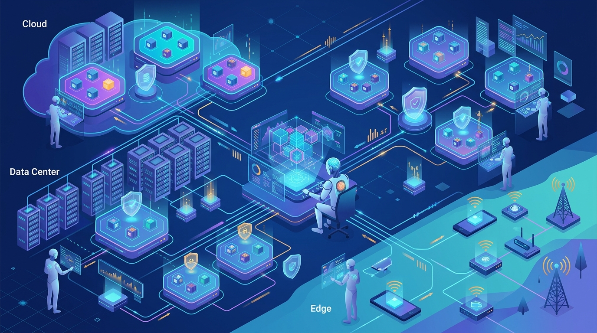

Durante años la IA fue "una preocupación de la aplicación": los modelos corrían encima de la infraestructura y la pila de abajo no cambiaba. Eso se acabó. Hoy la IA toca cada vez más interacciones y cargas de trabajo, y un reporte de Forrester describe el stack de cómputo de IA moderno como algo que va desde los modelos hasta —y a través de— la infraestructura que los sostiene.

Y ahí Kubernetes sigue siendo el punto de control: sirve para programar workloads, aplicar políticas y presentar una interfaz consistente entre datacenter, nube y edge.

## Agéntico no es "el mismo script de siempre"

La diferencia entre automatización tradicional y un sistema agéntico es que el primero ejecuta el mismo script aunque el entorno haya cambiado, y el segundo **observa, razona y actúa**. Aplicado a la gestión multi-clúster, un agente lee el estado del clúster y los datos operacionales, propone un diagnóstico o un siguiente paso, y ejecuta acciones dentro de un alcance aprobado —casi siempre con un humano que firma antes.

El valor real no está en el modelo en sí, sino en **la calidad del contexto que el agente puede ver y los límites que le pones**. Sin estado del clúster, políticas y reglas de acceso, un agente solo adivina. Un modelo bien entrenado entiende Kubernetes "a nivel básico", pero no conoce tu estado, tus políticas ni tus cambios recientes.

## El toil es el enemigo

En operaciones de Kubernetes, el toil toma la forma de triage repetido, correlación manual de señales, seguimiento de alertas y chequeos de rutina. No son tareas difíciles, pero se comen el tiempo de los equipos y postergan la modernización proactiva. Una encuesta reciente sobre cómo la IA aporta valor a DevOps destaca la **reducción de toil** como una de las oportunidades más claras.

Un agente puede juntar señales, correlacionarlas y proponer una causa probable para que un ingeniero la evalúe, siempre bajo revisión humana.

## Los principios que importan

Para construir infraestructura inteligente sin soltar el control:

- **Contexto observable primero:** dar acceso al estado, políticas e historial antes de razonar.
- **Separar sugerencia de acción:** que recomiende libre, pero que cualquier cambio espere aprobación humana.
- **Conectar con los controles existentes:** identidad, reglas de acceso y auditoría que el equipo ya confía.
- **Mantener el ecosistema abierto:** plataformas que integren herramientas y estándares, no que te encierren en un solo stack.

SUSE (con Rancher Prime y SUSE AI Factory) ya empuja este enfoque: asistentes que funcionan como una "crew" de agentes especializados con un router inteligente, soporte para servidores MCP externos y validación humana antes de ejecutar. La idea de fondo: **agéntico sí, pero con gobernanza**.

**Fuente:** The New Stack.
