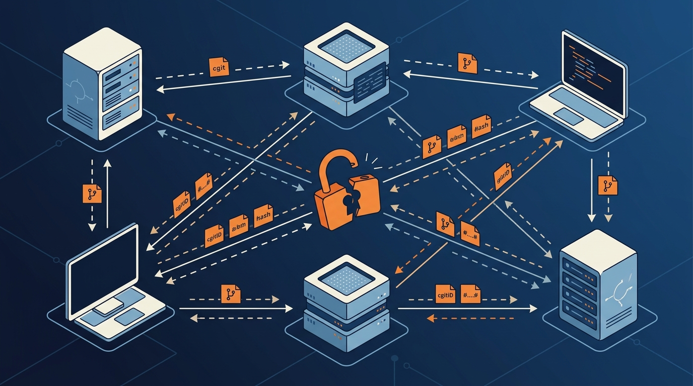

Radicle, la red peer-to-peer de colaboración de código que se presenta como la alternativa descentralizada a GitHub, acaba de revelar **dos vulnerabilidades críticas en su protocolo de red** que eliminan la confidencialidad en todas las versiones de nodo lanzadas hasta la fecha. El impacto es feo: un atacante en el camino de la red puede **leer datos de repositorios privados en texto plano** y **suplantar nodos** en las allow-lists de conexión.

## El bug de fondo: el handshake que no cifraba nada

La falla está en `radicle-node`, el daemon principal que gobierna la sincronización entre peers. El ingeniero independiente **Kostis Maninakis** identificó el problema: Radicle ejecuta un handshake del Noise Protocol Framework al establecer la conexión, pero el daemon **descarta los estados de cifrado resultantes inmediatamente después de la negociación**.

Traducido: el protocolo hace un handshake Noise XK de tres mensajes sobre sockets TCP crudos, deriva dos claves simétricas de sesión (el famoso "split" criptográfico)... y después las deja sin leer en memoria. Todo lo que viene después —metadata de gossip, tablas de routing y los raw Git object packs— se despacha **directamente por el socket TCP sin cifrar, en cleartext**.

## La segunda falla: suplantación de nodos

El handshake también tiene un defecto de validación de autenticación. Un atacante puede **forjar una conexión presentando un Node ID falso** asociado a un peer permitido. Combinado con lo anterior, un eavesdropper en el camino puede capturar Node IDs válidos que viajan en claro y luego explotar el defecto para **hacerse pasar por un nodo autorizado y jalar repos privados directamente desde los seed nodes**.

La causa raíz está en una divergencia arquitectónica en Heartwood, el repo Rust subyacente: la máquina de estados de red procesa el handshake Noise, pero la capa de framing **se salta las rutinas de cifrado durante las escrituras**. El tráfico capturado entre dos daemons locales lo confirma: los frames post-handshake no traen authentication tags ni stream ciphers.

## Qué hacer ahora

Los mantenedores son claros: **todos los repos privados clonados, pusheados o sembrados por conexiones clearnet deben tratarse como comprometidos**. Hay que rotar de inmediato cualquier token, credencial o secreto de producción que esté dentro de esos repos.

Mientras no salgan binarios parcheados, los equipos deben restringir las operaciones de nodo a **overlay networks aisladas** —túneles WireGuard o SSH port forwarding entre hosts autorizados. Ojo: configurar el proxy global hacia nodos de salida Tor **no** remedia la exposición, porque el tráfico que sale del exit node sigue viajando por internet público sin cifrar.

## El arreglo romperá compatibilidad

La decisión de fondo: abandonar por completo la capa de transporte Noise custom y migrar a **Iroh**, un stack de networking P2P open source construido sobre QUIC y TLS. El problema es que los nodos actuales no tienen campos de negociación de versión en los frames del handshake, así que no se puede meter un parche de cifrado sobre la estructura wire existente sin causar caídas de conexión. Resultado: la transición a Iroh **romperá la compatibilidad retroactiva** y generará una partición dura de red entre instalaciones legacy 1.x y los nodos actualizados.

Moraleja para los equipos que apostaron por Radicle como alternativa descentralizada: la descentralización no te salva de un transporte sin cifrar. Si tu repo era privado y vivía en esta red, rótalo todo.

**Fuente:** [InfoQ](https://www.infoq.com/news/2026/09/radicle-network-vulnerabilities/) / [Radicle disclosure](https://radicle.dev/2026/09/23/disclosure-of-vulnerability-in-network-protocol).
