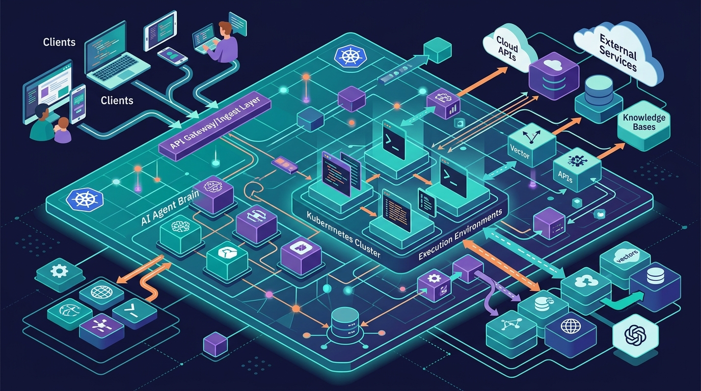

Craig McLuckie —co-fundador de Heptio, uno de los creadores de Kubernetes y hoy CEO de Stacklok— publicó un post en el blog de la CNCF que vale la pena leer con calma. La tesis: los agentes de código se volvieron útiles cuando **dejaron de ser un chat box**, y eso fue gracias a cuatro cosas —tools capaces, un repo y filesystem compartidos, subagentes, y skills que capturan lo aprendido. El problema es que esos patrones nacieron **en el laptop del desarrollador**, y ahí no van a quedarse.

## El harness de escritorio cruje

La mayoría de los harness asumen un escritorio: una persona, una máquina, un filesystem local y un solo proceso interactivo que es a la vez la UI, el agent loop, el sandbox, el credential store, el tool host y la base de sesiones. Eso le sirve a un developer individual. Pero calza mal cuando una organización quiere **correr cientos de sesiones, gobernar qué tools puede llamar cada una, sobrevivir a que un nodo se muera a mitad de tarea**, o dejar que alguien parta una sesión en el laptop y la retome desde el teléfono.

La tentación es meter el harness de escritorio en un contenedor y darlo por resuelto. McLuckie lo despacha rápido: *"Kubernetes le enseñó a esta industria que un monolito en un contenedor sigue siendo un monolito. La lección aplica también a los agentes."*

## Mecatl: el loop separado de todo

La respuesta de Stacklok es **Mecatl** (se pronuncia "meh-kah-tl", del náhuatl clásico: cuerda o arnés), un harness cloud-native que acaban de open-sourcear. La idea central es diseñarlo como **aplicación distribuida desde el arranque**, con el agent loop separado de todo lo que lo rodea, para que hosting, exposición y seguridad **caigan de la arquitectura** en vez de atornillarse después.

El motor (core engine) se queda con el loop: razonamiento, dispatch de tools, permisos, hooks y emisión de eventos. Todo lo demás vive afuera, detrás de interfaces explícitas:

- **Clientes** — TUI (`mecatui`), APIs gRPC y HTTP/SSE, y un SDK TypeScript.
- **Entornos de ejecución** — workspaces asignados y command runners donde ocurre el trabajo.
- **Ecosistema de tools** — tools built-in, servicios MCP streaming-HTTP, skills e integraciones, expuestos vía catálogo.
- **Servicios de soporte** — model providers, estado de sesión, historial de eventos, identidad y coordinación.

El mismo loop corre en tu terminal, como servicio o sobre Kubernetes sin reemplazarse. Ese es el punto del split.

## Lo que habilita ese desacople

- **Correr el loop como una aplicación**: el motor es un componente versionado y desplegable. En Kubernetes, los workers son reemplazables en operación normal.
- **Sesiones que sobreviven al worker**: estado e historial viven en storage durable bajo un modelo de coordinación single-writer. Si un worker muere, un reemplazo **resume desde el último turno persistido**. Un pod eviction deja de ser el fin de la conversación.
- **Gobernar las tools**: un harness de escritorio es útil en parte porque tiene un shell sin restricciones. Mecatl **no necesita uno**: expone tools con propósito, con permisos, auditoría y límites de ejecución alrededor de cada una.
- **Atender a más de un tipo de cliente**: como el cliente no es dueño del filesystem, las credenciales ni el estado, el mismo loop puede respaldar una terminal, un servicio remoto, una app embebida y un deploy en Kubernetes a la vez.

## Lo que viene (y donde piden ayuda)

McLuckie es honesto: Mecatl está en pañales y el "harness cloud-native" es más una dirección que una arquitectura terminada. Los problemas más duros siguen en borrador, y son exactamente los que esta comunidad ya peleó antes:

- **Identidad**: cuando un agente llama a un sistema externo, ¿quién llama? La propuesta es hacer de Mecatl su propio SPIFFE trust domain y codificar la cadena completa de delegación en un JWT.
- **Tools más allá de MCP**: rutear el input/output de cada tool por la ventana de contexto es caro. Explorando *scoped resource grants* como permisos short-lived y paths directos tool-a-servicio.
- **Attestation de contexto**: "los prompts son el nuevo código" y deberían versionarse, firmarse y trazarse como cualquier artefacto de supply chain.

El proyecto está en [github.com/stacklok/mecatl](https://github.com/stacklok/mecatl) y la doc en [mecatl.dev](https://mecatl.dev/).

**Fuente:** [CNCF Blog — The case for a cloud native agent harness](https://www.cncf.io/blog/2026/09/28/the-case-for-a-cloud-native-agent-harness/).
