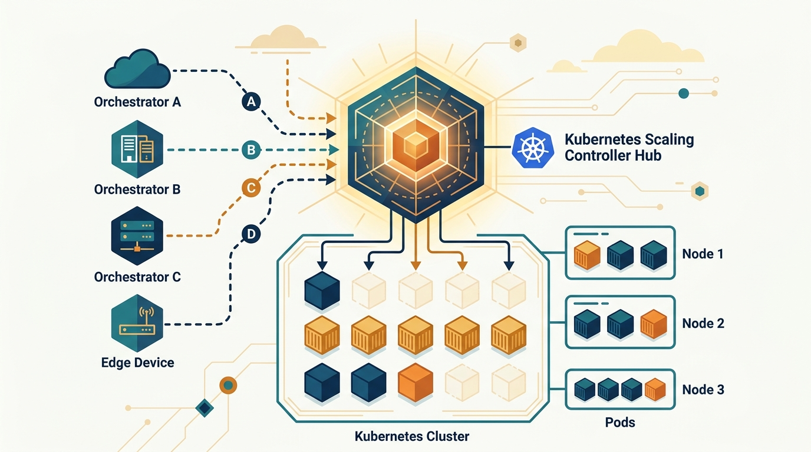

Uber publicó un post técnico bien jugoso sobre cómo evolucionó su plataforma de cómputo: pasó de un único orquestador de escalado a un modelo donde **varios orquestadores pueden controlar el escalado de los mismos workloads de Kubernetes** de forma segura. La pieza, escrita por los ingenieros Egor Grishechko y Srikar Paruchuru, explica el porqué y el cómo del nuevo controlador **ServiceScale**.

## El contexto: una flota enorme

El equipo de Container Platform de Uber maneja más de **100 clústeres de cómputo** entre datacenters y nubes como Oracle y Google, con cerca de **4.000 servicios corriendo sobre 3 millones de cores** y **1,5 millones de lanzamientos de pods diarios**. Encima de todo eso está **Up**, la capa de federación interna para la flota Kubernetes, donde los dueños de servicio despliegan builds y fijan expectativas de escalado. Un controlador dedicado, el **Uber Deployment Controller (UDC)**, traduce esa intención a primitivas de Kubernetes.

## El detonante: failover regional

El cambio nació de cómo Uber maneja los failovers. La compañía corre datacenters active-active en distintas regiones: cuando hay una caída, el tráfico se redirige a la región sobreviviente, que necesita capacidad ociosa para absorber la carga. Históricamente Uber mantenía capacidad ociosa reservada en todos lados, lo que es caro. La idea nueva era **reutilizar capacidad de workloads de baja prioridad**: bajarlos y subir los de alta prioridad durante el failover.

Eso introdujo una **segunda fuente de intención de escalado**. Up y UDC seguían a cargo del estado deseado normal, pero ahora un orquestador de failover también necesitaba influir en las decisiones de escalado.

## Por qué no estiraron el UDC

Extender el UDC con lógica de failover se descartó rápido. El UDC ya está en la ruta caliente de las operaciones del ciclo de vida de los servicios, y meterle comportamiento de failover habría subido la complejidad de un controlador que mueve los flujos más críticos. Como bien lo ponen los autores: *"una regresión en el manejo de failover no quedaría aislada al failover"* — podría afectar despliegues normales en toda la flota.

## La solución: ServiceScale

En su lugar, crearon un nuevo CRD llamado **ServiceScale** y un **Service Scale Controller (SSC)**. Cada orquestador expresa su propio deseo de escalado a través de ServiceScale, y el SSC reconcilia la intención combinada en objetos de Kubernetes. La clave del diseño fue mantenerlo simple, sin base de datos externa ni servicio de coordinación aparte:

> "No queríamos una base de datos externa adicional, un servicio de coordinación separado ni un plano de control que se volviera más difícil de debuggear bajo la presión de un incidente."

El post cierra con las lecciones de producción: cómo lidiar con el **estado de Kubernetes, los cachés stale y los planos de control con múltiples escritores**. Material obligado si te toca operar plataformas a escala.

Fuente: [Uber Engineering Blog](https://www.uber.com/us/en/blog/evolving-ubers-compute-platform/) y [InfoQ](https://www.infoq.com/news/2026/09/uber-kubernetes-scaling/).
