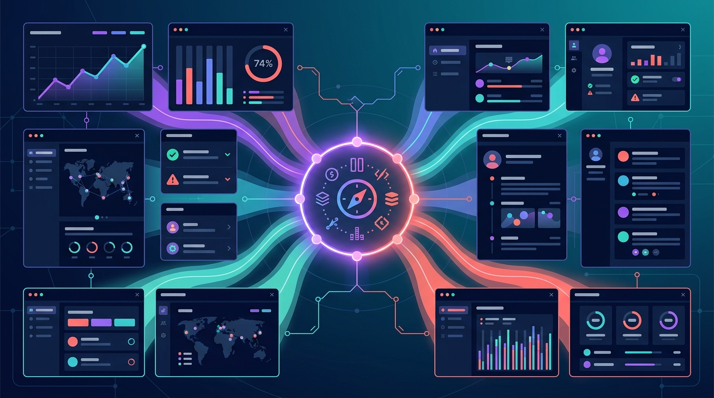

Si abres Dynatrace hoy y se te hace raro, no es tu pantalla: la plataforma completa recibió un rediseño visual de golpe. Menos capas visuales, mejor contraste en modo oscuro, colores de estado y gráficos más vibrantes y fáciles de distinguir, y nuevas paletas temáticas para los charts. Lo interesante no es el cambio estético en sí, sino **cómo lo hicieron**: todo llegó a todas las apps el mismo día, sin que nadie tuviera que mover un dedo.

## La magia está en Strato

Todas las apps de Dynatrace comparten el design system **Strato**, que funciona con *design tokens* versionados (colores, sombras, bordes) más componentes comunes: botones, tablas, filtros, selectores de tiempo. El refresh se shipó como un set de releases de tokens, así que cada app que renderiza esos tokens lo heredó automáticamente. Cero trabajo de reskinning coordinado entre equipos.

El mismo modelo aplica a la accesibilidad: soporte de teclado, indicadores de foco y tamaños mínimos de targets viven en los componentes, así que mejoran en todas partes a la vez. Y el estado actual quedó documentado en un **reporte de conformidad independiente** — detalle que no se ve seguido en este tipo de anuncios.

## Filtrar por valor, no por nombre de campo

Cambio chico en pantalla, grande en el día a día: antes para filtrar tenías que saber el nombre del campo de memoria. Ahora escribes un valor (por ejemplo, `error`) y el campo de filtro te sugiere la expresión completa (`status = error`). Pasas de "la cosa que estás viendo" directo al filtro que la expresa, sin estudiar el modelo de datos de antemano.

## El timeframe que te sigue a todas partes

Otro pedido recurrente de clientes: estás investigando una ventana de 40 minutos alrededor de un despliegue y quieres los logs de exactamente esa ventana en otra app. Ahora el selector de tiempo **recuerda tus rangos recientes y los ofrece donde estés**, e incluso puedes copiar un timeframe y pegarlo en otra app o en otra pestaña del navegador. La interfaz reconoce lo que ya hiciste en vez de pedirte que lo memorices.

## Y sirve para tus propias apps

Como Strato es un design system con librería de componentes (no una guía de estilo), las apps que construyas sobre Dynatrace usan las mismas tablas, filtros y charts que la plataforma. Heredas además lo pesado: la topología ya modelada en **Grail** y **Smartscape**, **DQL** como lenguaje único para logs, métricas, traces, eventos y topología, y permisos que no tienes que construir desde cero.

**El detalle fino:** con cada app de Dynatrace heredando tokens compartidos, esto es básicamente un case study de lo que un design system bien administrado puede hacer a escala plataforma. Rediseño total, un solo deploy, cero coordinación entre equipos. Así se hace.
