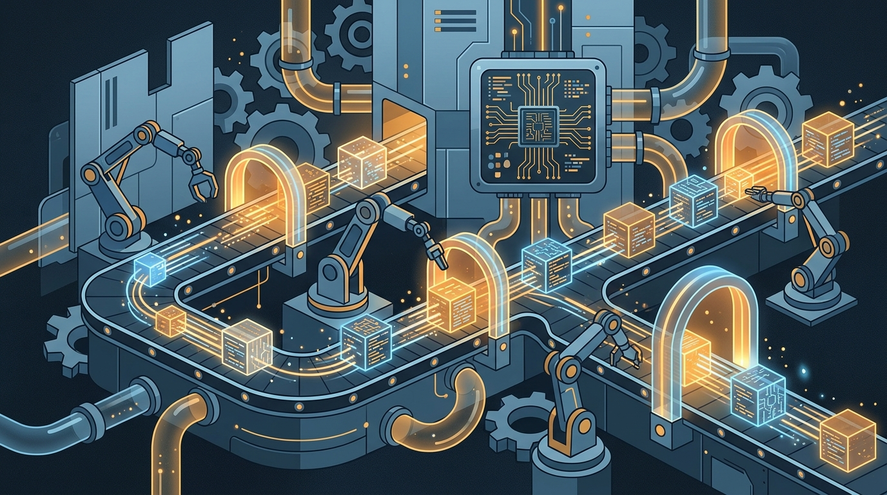

CloudBees, uno de los stalwarts del CI/CD enterprise (y casa de Jenkins), se la jugó: su nuevo CEO **Mo Plassnig** confirmó en WeAreDevelopers (San José) que la compañía entra en un **pivot completo a organización AI-first**. Y según cuenta, el mandato del directorio fue directo: "no sigas como hasta ahora".

## La tesis: código máquina a escala

Plassnig —cofundador de Codeship, la startup de CI/CD que CloudBees adquirió hace 8 años— volvió a la casa justamente por esto. Su lectura: la IA generativa está produciendo un **cambio de un orden de magnitud en el volumen de código**. Y mientras las redes sociales debaten si los agentes "roban pega", los líderes enterprise tienen un problema mucho más concreto: cómo administrar el diluvio de software que está saliendo de los modelos.

Tras meses recorriendo Fortune 500 y organizaciones públicas grandes, su conclusión es que **lo que pasa en terreno difiere bastante del hype**: todos reconocen que el coding agéntico es el futuro, pero adoptarlo en enterprise "no es estrictamente un problema de tecnología" — exige transformación de procesos, governance y seguridad estricta.

## Por qué importa

Si el código lo escribe cada vez más una máquina, la infraestructura que lo construye, prueba y despliega se vuelve el punto de control natural: pipelines que absorben volumen masivo de PRs generados, gates de calidad automatizados y governance sin ahogar la velocidad. Justamente el patio de CloudBees y Jenkins.

**El punto:** cuando una empresa que vive del CI/CD enterprise declara pivot AI-first, no es moda — es señal de que toda la capa de delivery está a punto de rearmarse alrededor del código generado por agentes. Los que operamos pipelines conviene ir mirando cómo se ve un CI/CD diseñado para throughput de máquina y no de humano.

**Fuentes:** [The New Stack](https://thenewstack.io/cloudbees-ai-first-pivot/)
