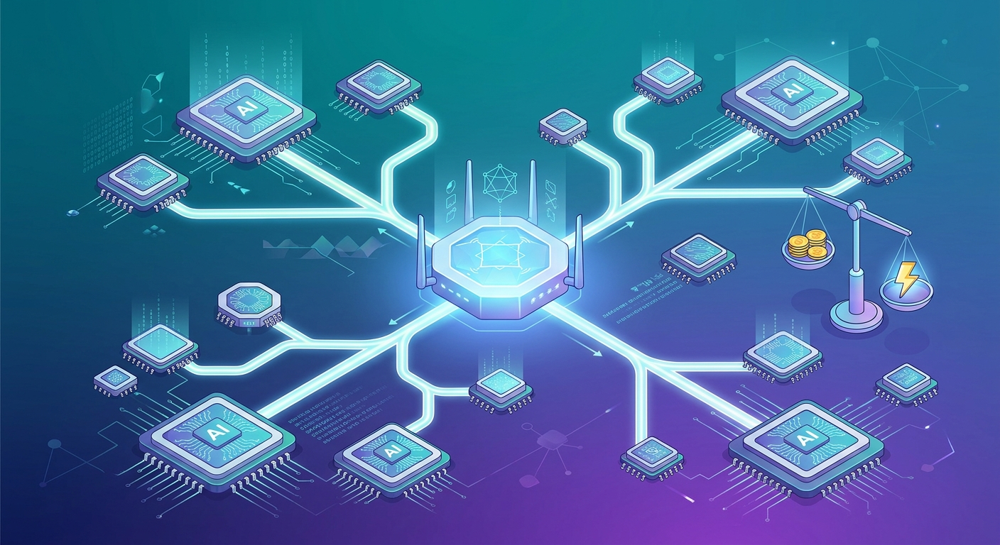

La pregunta de "¿qué modelo uso para esto?" se está volviendo tan rutinaria que ya nadie la quiere responder. Cloudflare la resolvió con un nombre de modelo: **`cloudflare/auto`**. El **Auto Router**, ahora en **beta pública** dentro de AI Gateway, recibe cada request y decide en el edge qué modelo es suficientemente capaz para la tarea — sin que el usuario final elija nada. En uso interno, Cloudflare reporta **ahorros de hasta 30%** frente a usar solo modelos frontier como OpenAI Sol o Claude Opus.

## Los números

Cloudflare lo evaluó contra GPT-6 Sol y Claude Opus 5.5 en un benchmark interno de trabajo de conocimiento (97 tareas con email, calendario, Slack, archivos, viajes y finanzas, tres muestras por tarea):

- **cloudflare/auto**: 86,6% de éxito, $0,0084 por tarea exitosa
- **OpenAI GPT-6 Sol**: 84,2% de éxito, $0,0108 por éxito
- **Anthropic Claude Opus 5.5**: 96,6% de éxito, $0,0210 por éxito

Traducción: rendimiento comparable a los modelos del día a día, a **80% del costo de Sol y 35% del costo de Opus**. El ahorro sale de no pagar tarifa frontier por trabajo que no es frontier.

## Cómo funciona

El diseño es de lo más interesante del anuncio:

1. **Pool de modelos**: filtra los que no soportan el formato o modo de ejecución, respeta credenciales, políticas de acceso y spend limits, y saca upstreams caídos para reincorporarlos tras la falla.
2. **Clasificador en el edge**: una vista compacta de la conversación (priorizando los turnos recientes) va a un modelo de clasificación multi-cabeza corriendo en **Workers AI sobre GPUs del edge**. Produce probabilidades sobre **14 categorías de tarea** (coding, planning, research, análisis de datos...) y puntajes de 1 a 5 en cuatro dimensiones: complejidad, ambigüedad, stakes y dependencia del contexto previo.
3. **Matriz de scoring**: esas señales se combinan con benchmarks para estimar calidad esperada, y el router elige el de mayor utilidad: `utilidad = calidad esperada − penalización adaptativa de costo`. En tareas simples pesa más el precio; a medida que sube la dificultad, el castigo al costo baja.

## El detalle fino: cachés y cambios de modelo

La parte que casi nadie modela: en sesiones agénticas largas, el costo real lo dominan las **cache reads**, no el precio de lista. Cambiar de modelo tira la caché a la basura y obliga a reescribir todo el contexto — y la mayoría de los modelos no puede leer los reasoning tokens de otro, así que hay que repensar el razonamiento a precio de output. Por eso el Auto Router aplica una **penalidad de switching** que crece con los tokens ya en contexto: dentro de un turno casi nunca conviene cambiar; entre turnos, el cambio tiene que ganárselo.

Cuando sale un modelo nuevo no hace falta reentrenar nada: se agregan sus pesos derivados de benchmarks a la matriz. Y vienen perfiles alternativos, como `cloudflare/auto-best`, que elige la máxima calidad esperada sin el tradeoff de costo.

## Por qué importa

Los gateways de IA venían siendo observabilidad y presupuestos — guardrails que dependían de que cada persona hiciera elecciones conscientes request por request. El siguiente paso natural era que **el gateway mismo tome la decisión**: suficientemente capaz, al menor costo, con failover incluido. Para cualquier organización con factura de tokens creciente, esto convierte el enrutamiento de modelos en infraestructura y no en una decisión de cada usuario. Vale probarlo en beta pública desde ya.

*Fuente: [Cloudflare Blog — Cut your AI spend with AI Gateway's Auto Router](https://blog.cloudflare.com/auto-router/)*
