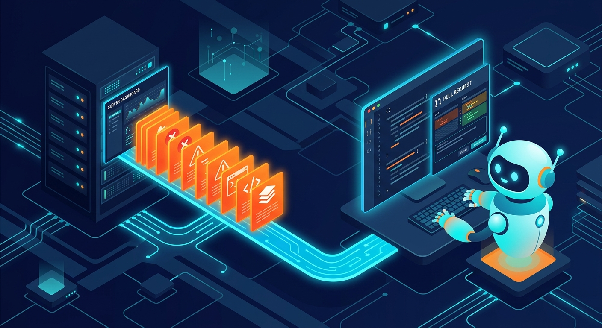

El flujo clásico del on-call está cada vez más corto, y Cloudflare le metió otra tecla menos: lanzó **Issues**, monitoreo de errores nativo para Workers que está en **beta abierta** y que no solo agrupa tus fallas de producción, sino que **se las manda directo a tu agente de código** para que investigue y abra un pull request. Chao copy-paste de stack trace en el prompt.

## Detectar fallas sin instrumentar nada

Issues viene construido dentro del runtime de Workers: **una línea de configuración** y no hay SDK que instalar ni wrapper que agregar. Una vez activado, captura:

- Excepciones no atrapadas e invocaciones fallidas
- Respuestas HTTP `5xx`
- Salida de `console.log()` y `console.error()`, incluidos logs con stack trace
- Alarmas que se disparan en loop y código que escribe volúmenes gigantes de logs dentro de bucles

La parte buena es la **agrupación**: si un deploy dejó el handler tirando errores, cada request fallida tiene su propio ID, pero Issues las junta en un solo issue con primera aparición, frecuencia y tendencia. Se acabó el incidente de "40 alertas, un solo bug".

## Contexto de negocio vía OpenTelemetry

Cloudflare puede ver qué pasó dentro del Worker, pero no sabe qué usuarios o cuentas importan para ti. Para eso usa la **API de OpenTelemetry que ya viene en el runtime** — de nuevo, sin instalar otro paquete:

```ts
import { tracing } from "cloudflare:workers";

const span = tracing.getActiveSpan();
span?.setAttribute("user.id", userId);
span?.setAttribute("account.id", accountId);
span?.setAttribute("session.id", sessionId);
```

Con esos identificadores en spans custom, cada ocurrencia del issue muestra si las fallas se concentran en una cuenta o sesión específica — antes de mandárselo al agente.

## Del issue al PR, automáticamente

Acá está el giro interesante: configurás una **Automation** una vez, y cuando un issue cruza un umbral de ocurrencias (o reaparece después de un período tranquilo), se envía solo al agente, con el error, stack trace, logs, trazas y la versión del Worker incluidos. Las integraciones nativas de lanzamiento:

- **Claude Code**, con un routine ID y token
- **Cursor**, vía automation webhook
- **Devin**, con API token y organización

El agente recibe el contexto estructurado, corre su workflow — triage, consultar más datos, proponer fix — y termina abriendo el PR. Lo que antes era "el humano reconstruye el contexto desde telemetría cruda" pasa a ser un handoff directo.

## Por qué importa

Esto es observabilidad dejando de ser un dashboard que miras y pasando a ser **el primer eslabón de un pipeline autónomo de remediación**: detectar → agrupar → contextualizar → delegar → PR. Los coding agents ya sabían leer logs y navegar repos; lo que faltaba era conectar los pasos sin un humano de pegamento en el medio. Que venga embebido en el runtime, gratis de instrumentar, baja la barrera bastante.

Para equipos con workloads serios en Workers, es un candidato obvio a probar esta semana. Para el resto, es una señal de hacia dónde se está moviendo todo el stack de observabilidad.

*Fuente: [Cloudflare Blog — Detect and send production issues straight to your agent](https://blog.cloudflare.com/real-time-issue-detection/)*
