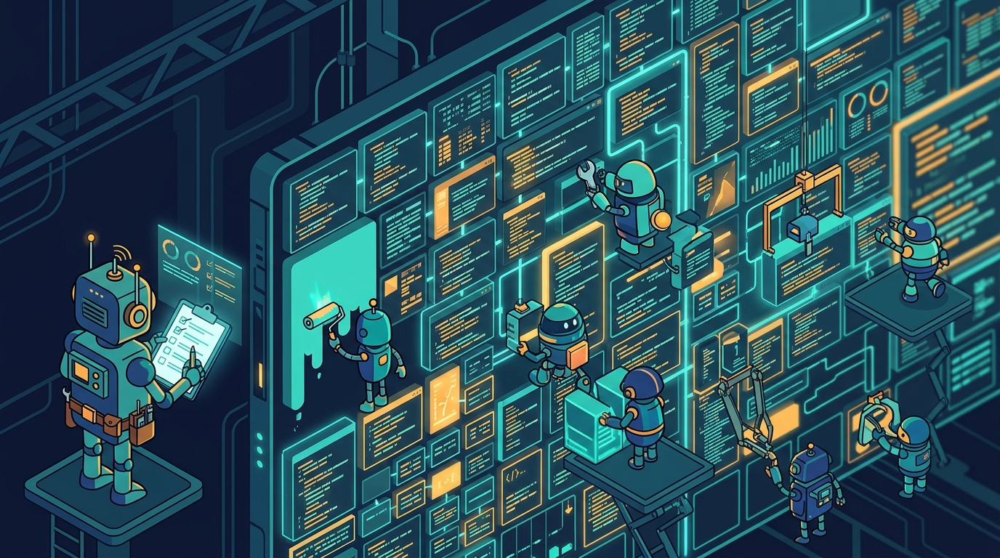

Si te cansaste de leer promesas sobre agentes de código, este caso al menos trae números duros: **CodeScene publicó un caso de estudio** donde agentes refactorizaron un codebase de **300.000 líneas de C en tres semanas**, con un costo de tokens de aproximadamente **US$4.000**. InfoQ lo cubrió hoy y la comunidad quedó partida en dos.

## Los números

El codebase elegido no es cualquiera: la **decompilación open source de Street Fighter III: 3rd Strike**. Los resultados:

- **2.903 commits** a través de **54 pull requests** (sí, mergeadas a main en un fork)
- **726 archivos** modificados, **252.055 líneas** cambiadas
- Code Health pasó de **5.6 a 10.0** (el máximo en la escala de CodeScene)

Adam Tornhill, fundador de CodeScene y autor de *Your Code as a Crime Scene*, dijo que era la primera vez en tres décadas trabajando en sistemas grandes que veía un desempeño de IA que calificaría de "superhumano a escala".

## Cómo lo lograron

Dos mecanismos cargaron el peso:

- **Señal de calidad:** el CodeHealth MCP Server le dio a los agentes un puntaje determinista que optimizar, para juzgar si cada transformación ayudó o empeoró.
- **Correctitud:** un harness de replay-trace que comparaba el hash del estado frame a frame, verificando el comportamiento después de cada cambio. En un juego de peleas con replay determinista, eso funciona de miedo.

Lo más interesante no son los commits sino lo que los agentes **construyeron en el camino**: un playbook de refactoring con **22 recetas y 82 notas**, incluyendo patrones clásicos (Extract Function, Guard Clauses) y otros específicos del codebase, tipo "Uniform Step Table" para convertir llamadas heterogéneas en dispatch por tabla. Los intentos fallidos también quedaron registrados.

## El matiz importante

El modelo importó: se quedaron con **Claude Opus** para el grueso del trabajo, reportando que Claude Code con Opus documentaba mejor los patrones emergentes que **Codex con Sol** (el mismo Sol que OpenAI presentó ayer en su DevDay). Con modelos más chicos, los archivos se estancaban en óptimos locales.

Y los escépticos tienen puntos legítimos:

- La replay determinista es el oráculo perfecto, pero **la mayoría de los sistemas legacy no tienen nada equivalente** — justo por eso refactorizarlos es riesgoso.
- Queda la duda de cuánto mide el modelo vs. cuánto mide el harness.
- DRY va por conocimiento duplicado, no por líneas idénticas; algunas recetas podrían estar colapsando conceptos distintos.

## La lectura

El caso demuestra que con **una señal de calidad objetiva y un oráculo de correctitud**, los agentes pueden hacer refactor masivo verificable. El problema es que el código enfermo de tu empresa suele carecer justo de esas dos cosas. CodeScene proyecta ~70% menos defectos inducidos por IA y ~45% menos desperdicio de tokens tras el uplift, pero eso es extrapolación de investigación previa: los US$4.000 y las tres semanas sí se midieron.

Ahora viene lo bueno: con Lund University harán un estudio donde estudiantes implementan features en ambas versiones (la 5.6 y la 10.0) con modelos frontier, comparando costo y calidad. Ahí sabremos si el Code Health alto de verdad compra algo.

**Fuente:** InfoQ, CodeScene.
