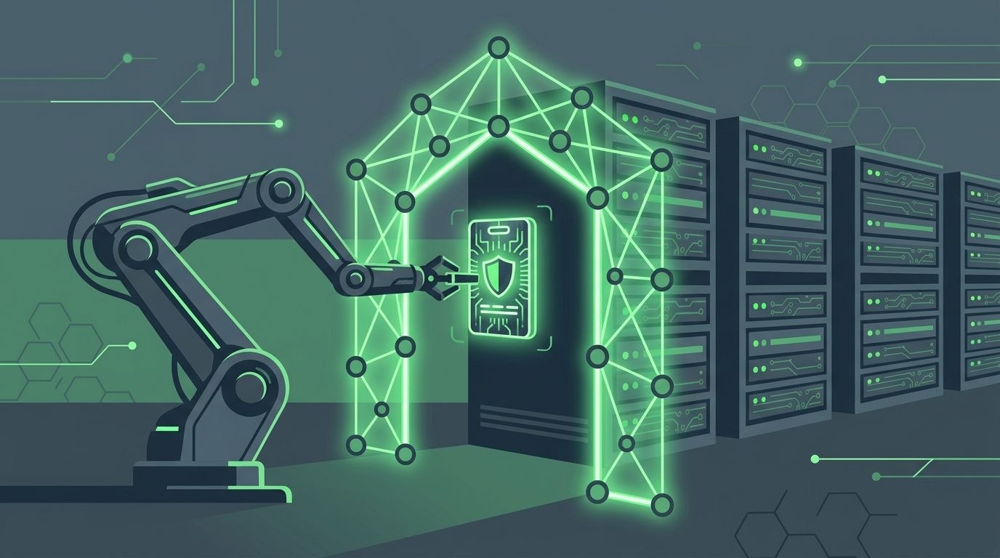

Los agentes de IA ya no solo sugieren comandos: analizan logs, investigan incidentes, revisan salud de sistemas y proponen próximos pasos. La pregunta incómoda que eso deja en cualquier enterprise: **¿cómo dejas que un agente toque la infraestructura sin abrir un agujero nuevo de seguridad y gobernanza?** HashiCorp respondió con un post práctico: **usar Boundary como capa de acceso zero trust entre el agente y los sistemas**.

## El patrón, en concreto

El ejemplo que muestran usa un agente construido con **watsonx.ai y modelos Granite de IBM** que investiga incidentes desde lenguaje natural ("investiga la presión de memoria en app-server-01 y resúmelo"). Lo interesante no es el agente, sino los controles alrededor:

- **El humano autentica, el agente opera**: el agente inicia login a Boundary, pero la autenticación la completa el platform engineer vía OIDC (IBM Verify en el demo). Nada de credenciales desatendidas flotando.
- **Conectividad zero trust**: el agente alcanza el target solo a través de una sesión activa proxada por workers de Boundary. Sin ruta de red directa, sin VPN, sin shell irrestricto.
- **Credenciales que el agente nunca ve**: **Vault almacena o genera credenciales short-lived dinámicas**, y Boundary las inyecta al establecer la sesión — sin devolverlas ni al agente ni al ingeniero.
- **Grants de mínimo privilegio**: acceso solo a los targets específicos que la tarea requiere.
- **Todo grabado**: session recording con metadata (target, usuario, host, conexión) más audit events de autenticación, decisiones de acceso y operaciones administrativas.
- **Kill switch**: un administrador puede cortar la sesión activa en cualquier momento.

## Por qué importa el patrón

La propuesta de fondo es elegante: **tratar al agente de IA como un operador más**, sujeto a los mismos controles de identidad, acceso, sesión y evidencia que un humano. No es "automatización sin supervisión" ni "asistente de solo lectura": es un workflow autorizado por humano, ejecutado por agente, con evidencia completa para compliance y post-mortems.

Con la cantidad de agentes AIOps que están llegando (los de Datadog, AWS, Dynatrace ya vimos por acá), la pregunta del acceso a infra es la que sigue. Este patrón de Boundary + Vault es una respuesta concreta y disponible hoy para quien ya vive en el ecosistema HashiCorp.

**Fuente:** [HashiCorp Blog](https://www.hashicorp.com/blog/secure-ai-agents-with-hashicorp-boundary)
