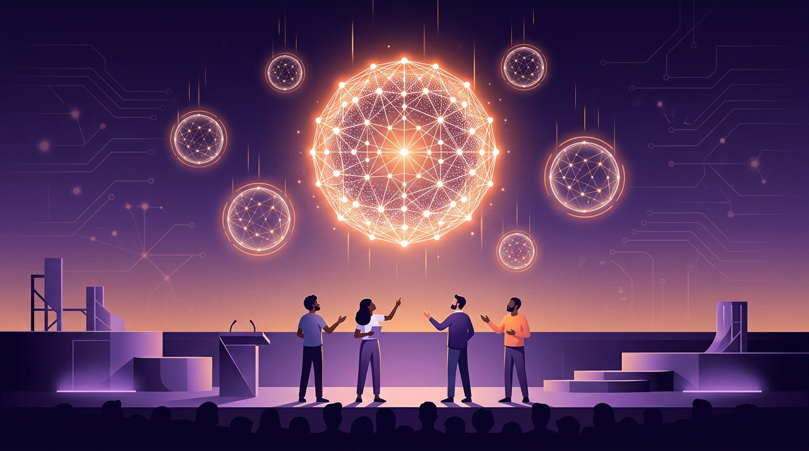

Se hizo el DevDay 2026 y OpenAI soltó más de 20 anuncios de una sola vez. Pero el que importa para quienes pagan la factura de la API tiene nombre y apellido: **GPT-6.1 Sol**.

## GPT-6.1 Sol: inteligencia casi-Astra, precio de gallina

La promesa es simple y brutal: **inteligencia cercana a GPT-6 Astra para coding, computer use y trabajo profesional, a un quinto del precio de Astra** en input y output de tokens vía API. O sea, la frontera de hace unas semanas, ahora con descuento del 80%.

Contexto rápido, porque esto viene acelerado: la semana pasada OpenAI ya había puesto GPT-6 Sol y Luna en Bedrock, Anthropic lanzó Claude Opus 5.5 un 40% más barato que Opus 5, y Astra llegó a GA en Microsoft Foundry. La conclusión de todo esto: **elegir modelo por tarea, y no "el más grande para todo", dejó de ser optimización y pasó a ser estrategia obligatoria**. GPT-6.1 Sol es exactamente ese golpe: el modelo de trabajo recurrente (dev, ops, uso de computador) a costo que se puede sostener en volumen.

## dots: asistentes que no se apagan

El otro anuncio grande fueron los **dots**: asistentes proactivos de OpenAI que **siguen trabajando a través de proyectos complejos y tareas cotidianas**, aunque tú no estés mirando. La idea es invertir el modelo de "pregunto-responde": el dot empuja el trabajo hacia adelante y te mantiene en control del avance. Si suena a la pieza consumer del mundo agéntico que venimos cubriendo, es porque lo es.

## Lo demás

El [recap oficial del DevDay](https://openai.com/index/devday-2026-recap) junta los 20+ anuncios: GPT-6 Astra, ChatGPT, Codex, APIs, seguridad y herramientas para builders. Si trabajas con la API de OpenAI, vale la pena el recorrido completo.

**El punto:** la inteligencia frontier se está abaratando más rápido de lo que la mayoría presupuesta. Si tu stack todavía asume un solo modelo caro para todo, este DevDay es la señal para repensarlo.

**Fuentes:** [Introducing GPT-6.1 Sol](https://openai.com/index/introducing-gpt-6-1-sol) · [Introducing dots](https://openai.com/index/introducing-dots) · [DevDay 2026 Recap](https://openai.com/index/devday-2026-recap)
