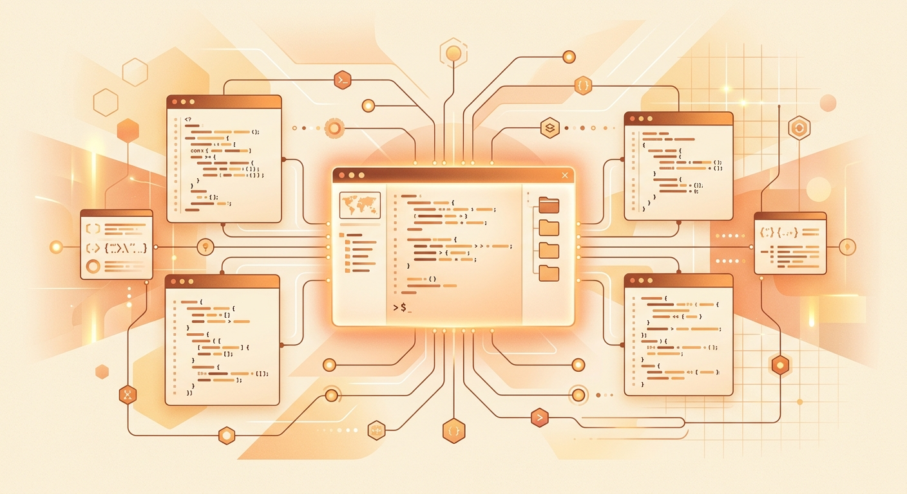

Anthropic sigue amontonando lanzamientos esta semana y hoy le tocó a los developers: **abrió claude.dev**, un sitio nuevo a cargo del equipo de Claude Devs, con deep dives de ingeniería, guías de Claude Code y la API, y tips de los propios equipos que construyen Claude.

## Qué es (y qué no es)

La idea es simple pero útil: **la documentación te dice cómo funciona cada feature; claude.dev te dice cómo la usan los ingenieros de Anthropic en el día a día**. Es la diferencia entre el manual del auto y el mecánico contándote sus trucos.

Los posts disponibles ya al lanzamiento incluyen perlas como:

- **"What a task costs on Opus 5.5"** — cuánto cuesta realmente una tarea en el modelo tope de gama.
- **"How we made claude.ai 3x faster in two weeks"** — optimización con cronómetro en mano.
- **"Lessons from building Claude Code: How we use skills"** — la experiencia propia sirviendo de playbook.
- Guías para trabajar con la familia 5.5 (**Opus 5.5** y **Sonnet 5.5**).

El contenido se ordena en cuatro categorías filtrables: **Agents, Engineering, Playbooks y Skills**, con tiempos de lectura que van de los 7 a los 21 minutos (posts fechados entre mayo y finales de septiembre de este año).

## Terminal mode, porque claro

El detalle simpático para la audiencia dev: el sitio tiene un **Terminal mode** que deja leer el blog con una interfaz estilo terminal, comandos incluidos (`/help`, `/posts`). También hay atajos de teclado (H para Home, D para Docs, T para Terminal) y videos de casos reales: un documental de 22 minutos sobre cómo el equipo de Claude Code usa Claude Code, más estudios de **Ramp y DoorDash**.

## Por qué importa

Para quienes trabajan con Claude Code o la API en pipelines de desarrollo, este tipo de contenido —costos reales por tarea, decisiones de ingeniería, lecciones aprendidas— es justo lo que no encuentra en la docs oficial. Es la misma jugada que hicieron otras compañías de infraestructura con sus blogs de ingeniería, pero enfocada 100% en el flujo de trabajo con agentes de código.

Fuentes: [CTH Community](https://cthcommunity.com/en/news/claude-dev-launch/), [claude.dev](https://claude.dev).
