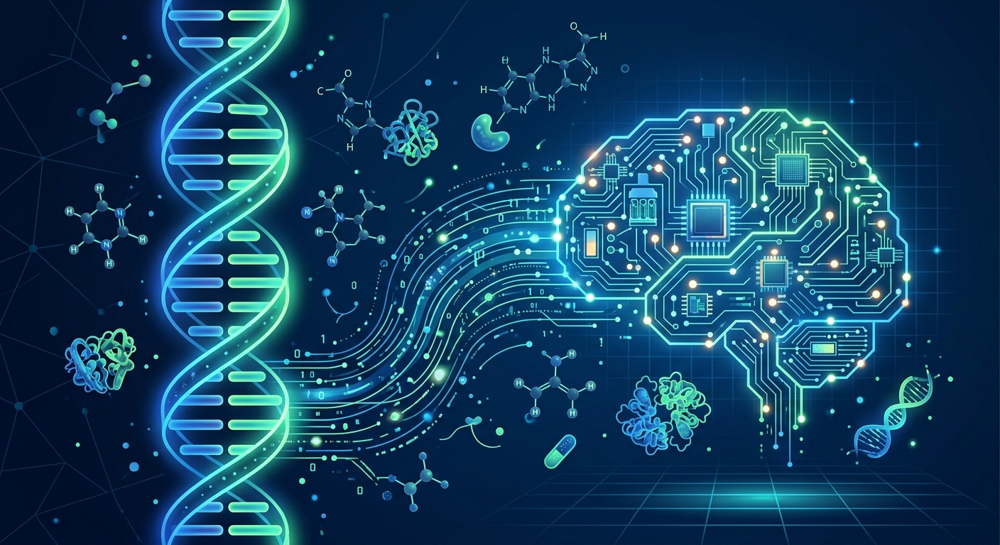

Noticia de esas que cruzan la IA con ciencia dura: **Anthropic anunció que Claude ayudó a un equipo de investigadores a identificar un sistema enzimático previamente no caracterizado en el ADN humano**, un mecanismo molecular que nadie había descrito antes. Los científicos todavía están averiguando qué hace exactamente y si tiene aplicaciones prácticas, pero la pista inicial apunta a que **podría ser útil para edición génica**.

## El laboratorio que nadie conocía

Lo más revelador del anuncio: **Anthropic confirmó por primera vez que mantiene un laboratorio de investigación biológica en California**, donde los investigadores toman las teorías que genera Claude y las ponen a prueba en el mundo real.

El flujo de trabajo: Claude examina secuencias de ADN asociadas a proteínas cuya función aún no se entiende, cruzando literatura científica existente con volúmenes grandes de datos genómicos, buscando patrones que merezcan investigación. La empresa aclara que todo esto ocurre en **niveles bajos de riesgo de bioseguridad** y que la IA no toca patógenos capaces de infectar humanos.

Dario Amodei, CEO de Anthropic, fue más lejos en X: eventualmente podría ser posible que **Claude mismo ejecute los experimentos controlando equipamiento de laboratorio de forma autónoma**, "con las salvaguardas apropiadas en su lugar — pero no estamos haciendo eso hoy".

## Contexto: la movida life sciences viene completa

Esto no salió de la nada. Ayer mismo Anthropic lanzó el **Life Sciences Verification Program (LSVP)**: acceso verificado a sus modelos **Mythos, Opus y Sonnet** con clasificadores relajados para trabajo en biología (drug discovery, desarrollo clínico, manufactura). El programa tiene grants de "Standard Use" y, para casos de doble uso, grants de "High-risk Use" con vetting adicional y renovación cada seis meses.

O sea: laboratorio propio, programa de acceso para científicos y un descubrimiento publicado. La estrategia life sciences de Anthropic dejó de ser roadmap y pasó a ser operación.

## La ironía

Todo esto ocurre un mes después de que el propio Amodei publicara un ensayo advirtiendo que los "swarms" de IA podrían tomar internet en seis meses si la industria no frena — con Elon Musk ("Dario is right") y Sam Altman sumándose públicamente al llamado. La semana pasada, además, la FTC abrió investigación a OpenAI y Anthropic por riesgos de IA. Pedalear la frontera bio y pedir frenar a la vez: el equilibrista está trabajando duro.

Fuentes: [UNILAD Tech](https://www.uniladtech.com/news/ai/anthropic-claude-found-previously-unknown-human-body-020739-20261001), [Anthropic — LSVP](https://www.anthropic.com/news/life-sciences-verification-program).
