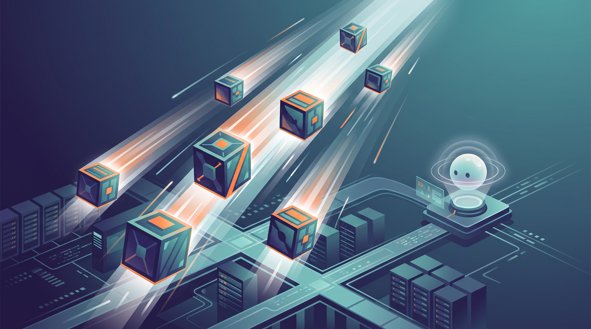

Si tu agente necesita "un computador" para trabajar, cada segundo de arranque es tiempo que tu usuario espera mirando un spinner. Cloudflare lo entendió y **reconstruyó Containers desde abajo** pensando en workloads agénticos.

## Los números

- **Arranque 6x más rápido**: la mediana cayó de poco más de 4 segundos a **648 milisegundos**, según un benchmark independiente de ComputeSDK.
- En pruebas de burst preliminares de Cloudflare, se crearon **cientos de miles de contenedores en segundos**.

## Qué cambió

La pieza clave es la nueva política de scheduling **`durable_object`**: en vez de fijar imagen y recursos al deploy (modelo tradicional de aplicación), ahora **el código elige en runtime** la imagen y el tipo de instancia de cada sandbox. Los agentes no deployan sandboxes anticipadamente: las crean on-demand, por tarea, y esperan que estén listas ya.

Se suman dos cosas más:

1. **Snapshots de filesystem en beta pública**: guarda el workspace del agente y restáuralo después. La tarea de hace dos días sigue donde quedó.
2. **Control nativo vía Durable Object**: cada Container tiene su DO al lado, administrando ciclo de vida y tráfico saliente, ahora con más capacidades directo en la API `ctx.container` — sin wrapper de por medio. El modelo llega a la versión 1.0 del Sandbox SDK.

## Quién lo está usando

Base44 (workspaces de app-building), Kilo Code (sesiones cloud-agent), Cursor Cloud Agents, Devin Outposts, OpenAI Agents API y Claude Managed Agents. El patrón es siempre el mismo: repos, package managers, compiladores y test runners aislados por sesión.

## El contexto

Esto empuja la misma tesis que venimos cubriendo todo el año: los agentes necesitan computadores desechables que arranquen al instante, no cuesten nada estando dormidos y se congelen/descongelen en un parpadeo. Azure acaba de responder con sus Sandboxes, Google con Pod Snapshots en GKE. La carrera del "computador del agente" está recién partiendo.

**Fuente:** [Cloudflare Blog](https://blog.cloudflare.com/faster-agent-sandboxes/)
