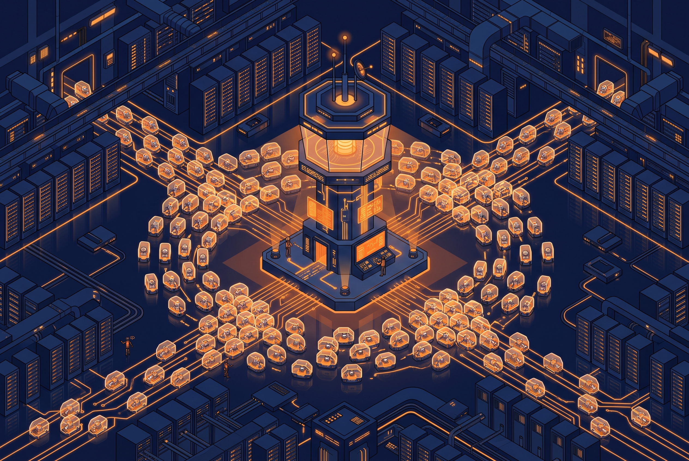

Si en el último año tu equipo de plataforma ha respondido a la pregunta "¿y cómo controlamos esto de los agentes?" con un "no se puede, mejor lo prohibimos", esta noticia es para ti. La OpenClaw Foundation anunció **OpenClaw Enterprise (OCE)**: un control plane open source, vendor-neutral y con licencia MIT para desplegar y gobernar **agentes IA persistentes** en infraestructura propia.

La frase que usa el propio proyecto en su repo es ambiciosa pero ilustrativa: **"Kubernetes para agentes"**. No es un modelo ni un asistente: es la capa de infraestructura que falta entre "el modelo puede hacer la tarea" y "la empresa se atreve a dejar que mil agentes toquen producción".

## ¿Qué trae exactamente?

- **Multi-tenancy y administración centralizada** de agentes por namespace.
- **Permisos de grano fino**, aislamiento de workloads y sandboxing.
- **Auditoría completa** de las acciones de cada agente.
- **Revisión de acciones con LLM**: mecanismos para que otro modelo evalúe lo que el agente está por hacer.
- **Todo reemplazable**: puedes traer tu propio modelo, tu propio agent harness y tu propia implementación de sandbox. Nada de stack vertical cerrado.

Se puede self-hostear desde ya: **Docker Compose para desarrollo local y Kubernetes para despliegues internos**, con un OpenClaw Control Plane (OCC) dedicado a deployment y lifecycle. El software es gratis y se mantiene gratis; pagas el compute, los modelos y la infraestructura de fondo, que igual pagarías en cualquier escenario.

## El pedigrí es lo interesante

OCE **nació adentro de OpenAI** y fue donado a la OpenClaw Foundation, donde hoy se desarrolla como proyecto independiente con contribuciones de **Red Hat y Nvidia**. Nada de venture vaporware salido de un laboratorio: los tres ya lo están usando.

- **OpenAI** corre agentes OpenClaw persistentes con acceso a sus codebases y plugins. Su agente interno "Androidclaw" —descrito por el ingeniero RJ Marsan— investiga builds rotos, identifica el PR responsable, traza problemas de producto hasta incidentes y en algunos casos **prepara y mergea fixes**. Marsan lo calificó de "kinda game changing".
- **Red Hat** lleva buena parte de 2026 trabajando el tema en OpenShift: aislar agentes de credenciales sensibles con namespaces separados, accesos restringidos y credential proxies, tratando el proceso del agente como **no confiable por defecto**. Es founding member de la Fundación y planea integrar los requisitos en su plataforma de IA.
- **Nvidia** aporta **OpenShell**, un runtime open source que mete agentes en entornos aislados con permisos deny-by-default y audit trails, más su Open Agent Safety Platform con monitoreo independiente.

## Por qué importa

El problema duro ya no es si el modelo ejecuta la tarea. Es si una empresa puede dejar que **cientos o miles de agentes persistentes** toquen sistemas de producción, repos internos, credenciales, APIs y datos corporativos sin que nadie tenga visibilidad ni control. La Fundación reconoce que varias áreas de IT simplemente **prohibieron** las plataformas de agentes por falta de controles.

OCE se posiciona justo en ese vacío: la capa de gobernanza entre "prohibido" y "caos total". Si tu equipo ya opera Kubernetes, la curva de adopción es razonablemente familiar.

- Repo: [github.com/openclaw/openclaw-enterprise](https://github.com/openclaw/openclaw-enterprise)
- Anuncio: [openclaw.ai/blog/openclaw-enterprise](https://openclaw.ai/blog/openclaw-enterprise)
- Cobertura de [VentureBeat](https://venturebeat.com/orchestration/openclaw-launches-free-enterprise-control-plane-for-persistent-ai-agents-backed-by-openai-red-hat-and-nvidia) y [The New Stack](https://thenewstack.io/openclaw-enterprise-kubernetes-agents/)
