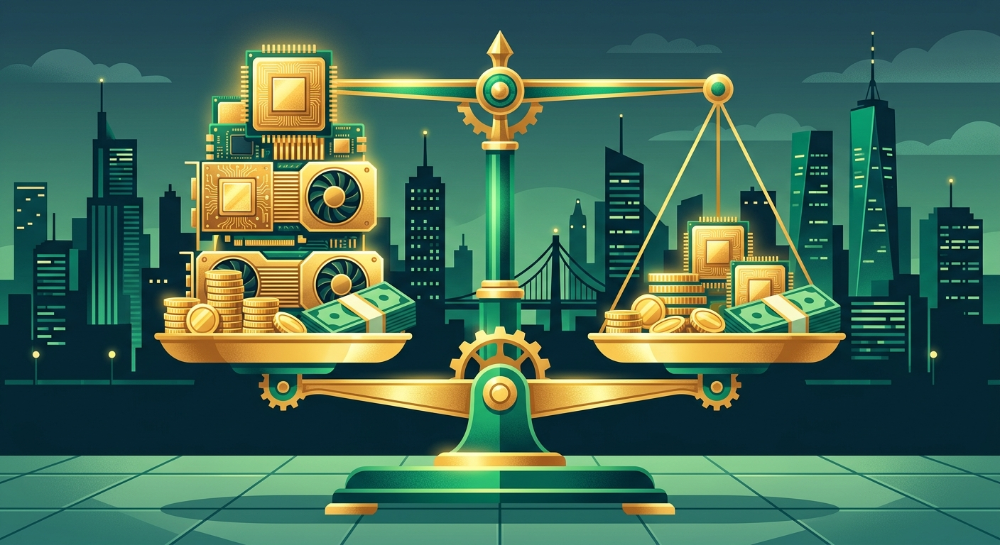

La carrera de IA llegó a un punto curioso: **los chips se están volviendo activos financieros, al estilo de aviones o inmuebles**. Según el [Financial Times](https://techstartups.com/2026/10/02/amazon-seeks-to-offload-8-billion-in-nvidia-ai-chips-to-investors-as-big-tech-turns-to-wall-street-for-ai-compute-financing/), **Amazon estaría buscando traspasar unos US$8.000 millones en chips avanzados Grace Blackwell de Nvidia a inversionistas externos**, a través de un vehículo de financiamiento de propósito especial.

## ¿Cómo funciona la movida?

La estructura es la clásica de asset finance: **los inversionistas serían los dueños del hardware**, mientras Amazon sigue usando los procesadores en sus data centers de EE.UU. mediante contratos de arriendo. Con eso, parte del costo upfront gigantesco de la infraestructura de IA **se sale del balance de Amazon**, pero el acceso al compute que necesita AWS se mantiene intacto. Eso sí: la propuesta sigue en discusión y no es una transacción cerrada.

## El contexto: capex insostenible en solitario

Amazon proyecta un gasto de capital de **~US$220 mil millones este año**, gran parte dirigido a infraestructura cloud, chips y data centers. Ante números así, la ingeniería financiera deja de ser opcional. Y si los hyperscalers empiezan a financiar GPUs vía vehículos dedicados de forma sistemática, **los inversionistas institucionales tendrían una ruta nueva para entrar al buildout de IA**, mientras los cloud providers preservan capital para seguir expandiendo.

## Por qué importa

Es otra capa de interdependencia financiera en un ecosistema que ya venía produciendo arreglos poco convencionales entre chipmakers, cloud providers y labs de IA. Traducción para los que operamos infra: **el costo del cómputo no solo se pelea en benchmarks y precios por token — ahora también se negocia en Wall Street**. Si esta estructura funciona, no tardará en replicarse. Y cuando el financiamiento entra, la salida también existe: ciclos de hardware, tasas de interés y apetito de riesgo pasan a ser variables de tu cloud.
