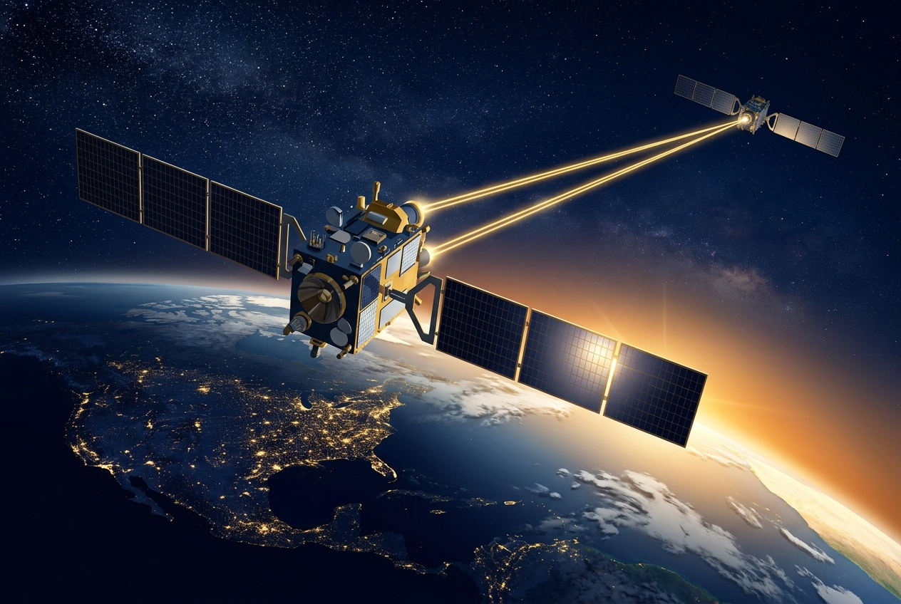

Mientras acá abajo peleamos por GPUs, cupos de energía y permisos de construcción, Google se adelantó y mandó el cómputo pa' arriba. El jueves 1 de octubre despegó desde Vandenberg el primer satélite prototipo de **Project Suncatcher**, la apuesta de Alphabet por llevar data centers de IA a la órbita, a bordo de un Falcon 9 de SpaceX en la misión rideshare Transporter-18.

## ¿Qué subió exactamente?

Un prototipo solar-powered construido junto a **Planet Labs** (que además llevó sus propios satélites en el mismo vuelo), equipado con **cuatro TPUs**, los mismos chips que Google usa masivamente en sus data centers terrestres. Es la primera prueba en órbita del plan de cómputo espacial de Alphabet.

Un detalle que gusta a los ops: antes de montarlos al cohete, los TPUs se sometieron a pruebas de radiación en UC Davis equivalentes a **cinco años de exposición orbital**. Alguien hizo su debida diligencia.

## El roadmap

- **Ahora**: primer satélite prototipo en órbita, probando cómputo real con TPUs en el espacio.
- **Principios de 2027**: dos satélites prototipo que probarán la **interconexión láser** entre sí, en una órbita heliosíncrona amanecer-atardecer a unos 650 km.
- **El sueño**: una constelación de cómputo de IA. Un paper de Google describe una configuración ilustrativa de **81 satélites en un clúster de 1 km de radio** — ojo, propuesta conceptual, no plan de despliegue.

## Por qué importa

La carrera del cómputo de IA tiene tres cuellos de botella en tierra: energía, terreno y refrigeración. En órbita, el sol sale sin pausa, el enfriamiento radiativo es gratis y nadie te pide permiso de obra. Google no es el único mirando esto (Starlink ya demostró láseres inter-satélites a escala), pero es el primero en poner **silicio de IA dedicado** arriba para validarlo.

Eso sí, entre un prototipo de 4 TPUs y un "data center constellation" hay una distancia astronómica: lanzar y mantener hardware en órbita sigue siendo carísimo, y el ancho de banda de vuelta a Tierra es el patrón. Pero como apuesta estratégica es clara: si el cómputo de IA se vuelve escaso en la Tierra, quien domine el cómputo orbital tiene una jugada que nadie más puede copiar rápido.

## Enlaces
- [CNN: AI data centers in space? Google kicks off the race](https://www.cnn.com/2026/10/01/science/google-ai-data-center-satellites-space)
- [CNBC: SpaceX launched Google AI chips to orbit with Planet Labs satellites](https://www.cnbc.com/2026/10/01/spacex-to-launch-google-ai-chips-to-orbit-with-planet-labs-satellites.html)
- [NPR: Google launches Project Suncatcher](https://www.npr.org/2026/10/01/nx-s1-5983697/project-suncatcher-google-ai-data-center-space)
