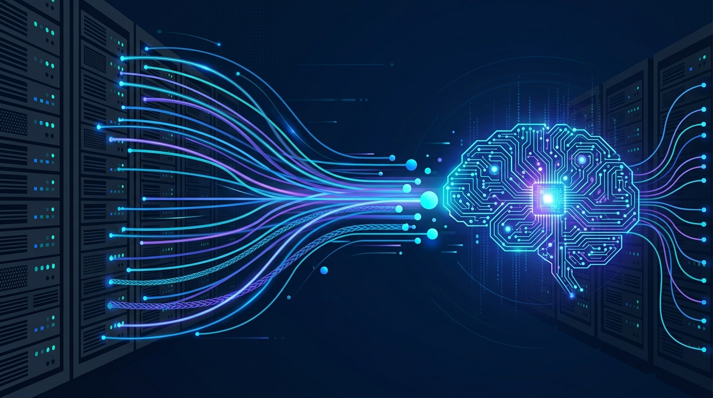

La observabilidad está pasando por su momento agéntico y NETSCOUT acaba de sumarse con un movimiento pragmático: **agregó conectividad MCP (Model Context Protocol) a su suite Omnis AI Insights**, permitiendo que asistentes y agentes de IA accedan directamente a su "Smart Data" en tiempo de ejecución. Nada de dashboards intermedios: el agente consulta la evidencia de red cuando la necesita.

## Qué hace exactamente

La suite se compone de dos piezas: **Omnis Sensor** captura información de red en puntos de observación y extrae contexto de aplicación, servicio, transacción y comportamiento en tiempo real; **Omnis Streamer** recolecta y prepara esos datos para consumo posterior. La novedad es que **el nuevo servidor MCP va incrustado en Omnis Streamer**, entregando datos ya preparados directamente a modelos y agentes bajo demanda.

La tecnología base es Adaptive Service Intelligence, que hace **extracción semántica y optimización de contexto antes** de que los datos bajen a sistemas downstream. La tesis de NETSCOUT: mejor alimentar al modelo con datasets pequeños y curados que con telemetría cruda voluminosa.

## El argumento económico y el técnico

Aquí está lo interesante para cualquier equipo operando agentes sobre datos operacionales:

- **Menos tokens, menos costo**: enriquecer la evidencia antes de que llegue al modelo reduce el volumen de datos a procesar. Con agentes consumiendo contexto a diestra y siniestra, preparar el dato de entrada es la optimización más obvia.
- **Menos alucinaciones**: Phil Gray, AVP de Product Management, lo resumió: *"no hay valor en conclusiones en las que no se puede confiar"*. La idea es dar a los sistemas de IA una fuente compacta y confiable de "verdad de red", en vez de señales operacionales fragmentadas.
- **Interoperabilidad**: además del acceso MCP directo, sigue integrando con Splunk, ELK Stack, Datadog, ServiceNow y Dynatrace. Los clientes existentes agregan las funciones vía Omnis Sensor Adaptors, sin reemplazar infraestructura.

NETSCOUT también publicó playbooks por industria (salud, servicios financieros, telcos) para moldear los datasets según el entorno operativo.

## El caso que vende la idea

El ejemplo que cita la compañía es clásico: herramientas de monitoreo de aplicación mostraban **cero errores y nada obvio que investigar**, mientras los usuarios igual sufrían. El problema estaba en la red — window size mínimo, retransmisiones totales, eventos zero-window — y Smart Data retuvo esa evidencia específica. Para equipos decidiendo cuánto automatizar el análisis de incidentes, acceder al registro de red subyacente ofrece una forma de **verificar o refutar lo que el agente de IA concluye**.

## Por qué importa

Es otra señal de que MCP se está convirtiendo en el estándar de facto para que agentes de IA consuman datos empresariales — y que los vendors de observabilidad están rediseñando sus pipelines pensando en consumidores de silicona, no solo humanos mirando dashboards. Curar el dato antes de entregarlo al modelo (en vez de tirar telemetría cruda al contexto) es una arquitectura que va a sonar cada vez más familiar en 2027.

*Fuentes: [ITBrief](https://itbrief.com.au/story/netscout-adds-mcp-links-to-omnis-ai-insights-platform-suite), [CFO Tech](https://cfotech.news/story/netscout-adds-mcp-links-to-omnis-ai-insights-platform-suite)*
