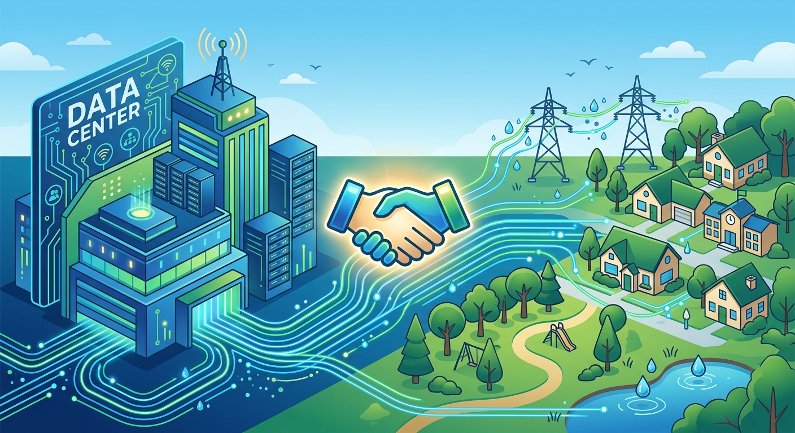

La carrera de la IA tiene un cuello de botella que no se resuelve con más GPUs: **los permisos y la buena voluntad de las comunidades donde van los data centers**. Por eso Amazon anunció este viernes el programa **"Built Together"**: una inversión de **más de US$1.000 millones en cinco años** para las comunidades estadounidenses que alojan sus data centers, junto con compromisos concretos sobre el impacto en **electricidad y agua** de estas instalaciones.

## Qué incluye el programa

Según el anuncio de [Amazon](https://www.aboutamazon.com/news/company-news/amazon-data-centers-built-together) y la cobertura de Reuters, el paquete considera:

- Inversión de **US$1.000+ millones en cinco años** en comunidades anfitrionas de data centers de AWS.
- **Educación y capacitación laboral** para residentes locales.
- Medidas para **abordar el efecto sobre la red eléctrica y el consumo de agua**, las dos quejas número uno de los vecinos.

## Los números del "lobby suave"

Amazon no anda con rodeos a la hora de explicar por qué el programa conviene: en el condado de Montgomery, Missouri, su proyecto pagará **más de US$1.800 millones en impuestos en 25 años**, contra unos US$200.000 del uso anterior del terreno. Y en Loudoun County, Virginia — capital mundial de los data centers — un estudio estima que **sin el ingreso fiscal de estos centros, el dueño de casa promedio pagaría US$5.800 adicionales al año en impuestos a la propiedad**.

O sea: el mensaje es que los data centers no solo consumen, también financian.

## El contexto real: moratorias

El trasfondo es que en varias localidades de EE.UU. han empezado a aparecer **moratorias a la construcción de data centers**, presionadas por el consumo energético y el ruido comunitario. El CEO de AWS, Matt Garman, ya advirtió que esas pausas **podrían frenar el liderazgo estadounidense en IA** — que Amazon describe como "la carrera que la nación no puede darse el lujo de perder".

## Por qué importa para los que operamos infra

Porque el buildout de IA no se juega solo en fábricas de chips y cables submarinos: **se juega también en el concejo municipal**. Si las comunidades empiezan a cerrar la puerta, el precio y la disponibilidad del compute suben para todos — desde hyperscalers hasta el que arrienda una VPS para correr sus agentes. Que Amazon pague mil millones para mantener abiertas esas puertas es, en el fondo, un dato de costo de infraestructura como cualquier capex: solo que este se paga en buena vecindad.
