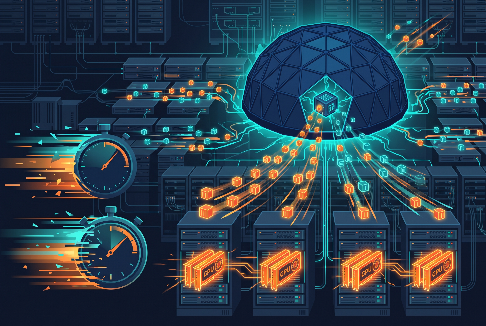

Google Cloud acaba de anunciar la disponibilidad general de **GKE Agent Sandbox optimizado para RL**, junto con el **Agent Sandbox RL orchestration SDK** e integraciones nativas para herramientas de reinforcement learning como Gymnasium, NVIDIA NeMo Gym y OpenHands. Si tu equipo entrena agentes con rollouts masivos en paralelo, esto va directo al bolsillo: el cuello de botella clásico son los clústeres GPU carísimos esperando minutos los cold-starts de sandboxes CPU, los pulls de imágenes multi-gigabyte y el churn que satura el API server.

## Los números del anuncio

Google lo benchmarkó contra Kubernetes crudo en un pool de 10 nodos gVisor, con un corpus SWE-bench de 500 imágenes y uno peor todavía: 4.578 imágenes de R2E que ni caben en disco local.

- **Time-to-first-command 10x más rápido**: de 44–85 segundos promedio a **1,1–8,8 segundos**.
- **Latencia de cola 45x mejor**: el peor caso bajó de 7,5 minutos a **menos de 10 segundos**. En RL el max es lo que define la duración del batch completo, así que esto es la métrica que importa.
- **3,1x menos churn en el control plane**: en un run de 4.578 imágenes × 4 rollouts (18.312 tareas simultáneas), las creaciones de pods cayeron de 18.312 a 5.869.

La ganancia se sostuvo en todas las configuraciones, desde 500 hasta 18.312 sandboxes concurrentes.

## Cómo lo lograron

Dos cambios explican casi toda la ganancia:

1. **Hidratación de imágenes fuera del camino crítico**: el SDK planifica la ubicación de imágenes entre nodos y, junto con GKE Image Streaming y el warm-pooling inicial, deja todo hidratado antes de que el rollout lo pida. Sin pulls fríos a mitad de entrenamiento, sin contención de I/O ni colas de minutos.
2. **Control plane con ritmo**: el Agent Sandbox Controller v1.0.0 agrega rate controls que acotan qué tan rápido se rellenan los warm pools, evitando el thundering herd contra etcd y el API server en los bursts.

Y el truco más simpático para el churn: en vez de recrear pods por cada paso de trayectoria (que a escala les disparó loops de garbage collection sin techo), el **reciclaje in-place** mantiene el pod vivo y hace un git reset + checkout del repositorio entre episodios. Además soporta snapshot, suspend/resume y forking de sandboxes para lógica de branching paralelo.

## Mistral AI ya lo ocupa en producción

La quote que acompaña el anuncio es de Jean-Malo Delignon (Mistral AI): orquestan cientos de miles de entornos seguros entre clústeres, con **picos de más de 30.000 sandboxes en un solo cluster**. No es un demo de laboratorio: es infraestructura de un lab de frontera.

Un detalle que vale oro para quien hace RL serio: el SDK **cuenta cada sandbox fallido como retriable** en vez de botarlo silenciosamente. Un rollout perdido sin registro no es solo una tarea menos: es reward bias escondido en tu entrenamiento.

## El takeaway

La apuesta de Google es clara: Kubernetes como sistema operativo de la era agéntica, y para llegar ahí sometieron su propio cluster a un loop de auto-investigación con benchmarks tipo SWE-bench — cada timeout de etcd y cada pico de GPU ociosa se devolvió al ciclo de desarrollo de GKE. Todo el stack es open source en kubernetes-sigs/agent-sandbox, así que podés reproducir los benchmarks en tu propio cluster con los reportes JSON que emite el harness.

El trade-off explícito: gastar CPU y tiempo de cluster barato calentando entornos para eliminar el recurso caro — GPU ociosa. Para un fleet de RL, la cuenta sale sola.

**Fuente:** [Google Cloud Blog — Accelerate agentic RL with GKE Agent Sandbox](https://cloud.google.com/blog/products/containers-kubernetes/accelerate-agentic-rl-with-gke-agent-sandbox)
