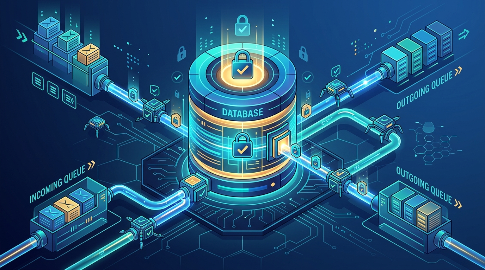

Google Cloud anunció la **disponibilidad general de Spanner queues**: mensajería transaccional nativa embebida directamente en Spanner. La premisa es simple y brutal a la vez: **crear un mensaje pasa a ser simplemente otra escritura dentro de tu transacción**. El cambio de estado del agente y sus acciones downstream se commitean juntos, atómicamente, o fallan completos.

## El problema que ataca

Los agentes de IA no solo responden consultas: emiten reembolsos, manejan inventario, ejecutan handoffs multi-paso y orquestan sub-agentes. Eso obliga a mantener estado interno en una base de datos operacional mientras se despachan acciones asíncronas por un sistema de mensajería separado (Pub/Sub, Kafka, lo que sea).

Y ahí está el dolor clásico: **dos sistemas con commit points disjuntos destruyen la consistencia transaccional**. Si el update de la base funciona pero el despacho del mensaje falla, tu agente decidió actuar pero no ejecutó. Si el mensaje sale pero la transacción de estado se revierte, el agente ejecuta una acción basada en estado inválido. En sistemas multi-agente, los retries, la especulación y las race conditions amplifican estos fallos y te obligan a construir outbox patterns, capas de idempotencia y workers de reconciliación — un impuesto de confiabilidad pesado para cualquier arquitectura agéntica.

## Qué traen las queues

- **Enqueue atómico "decide-y-actúa"**: en una sola transacción read-write de Spanner, el agente actualiza sus tablas de estado y encola tareas para agentes pares. Con la serialización estricta y consistencia externa global de Spanner, todo commitea como una unidad.
- **Ejecución programada y delays**: mensajes despachados al commit o agendados a futuro — retries con delay, check-ins programados o timers de escalada SLA sin cron externos ni infraestructura de polling.
- **Streaming SQL pull para workers**: los runtimes de agentes consumen tareas con lecturas streaming de SQL y acknowledgean la completitud dentro de una transacción.
- **Memoria episódica y handoffs**: las actualizaciones de memoria del agente (resúmenes episódicos, handoffs de contexto entre sub-agentes) se persisten asíncrona y transaccionalmente vía queues, sin bloquear los turnos interactivos.

## Detalles finos que importan

- **Exactly-once efectivo**: at-least-once delivery + at-most-once ACK para lograr procesamiento exactamente una vez.
- **A2A orquestado**: el handoff de un agente primario a un especialista es un mensaje durable y transaccionalmente commiteado, con lineage auditable.
- **Human-in-the-loop nativo**: una transacción registra el estado de aprobación pendiente y agenda la escalada automática; gana el que se dispare primero.
- **Observabilidad SQL**: backlogs, tareas en vuelo e historial de ejecución se inspeccionan con SQL estándar sobre las tablas de queue — nada de message stores cajón negro.

## En corto

Más allá de agentes, esto sirve como plataforma de mensajería multi-propósito para arquitecturas event-driven tradicionales: feeds de actividad, órdenes en retail, notificaciones financieras. La movida de Google es clara: si el estado y los mensajes viven en el mismo sistema transaccional, el outbox pattern muere y Spanner se vuelve el candidato natural para el cerebro operativo de tus agentes. La competencia (y el ecosistema outbox/Kafka) tendrá que responder.

**Fuente:** [Google Cloud Blog](https://cloud.google.com/blog/products/databases/spanner-queues-provide-native-transactional-messaging)
