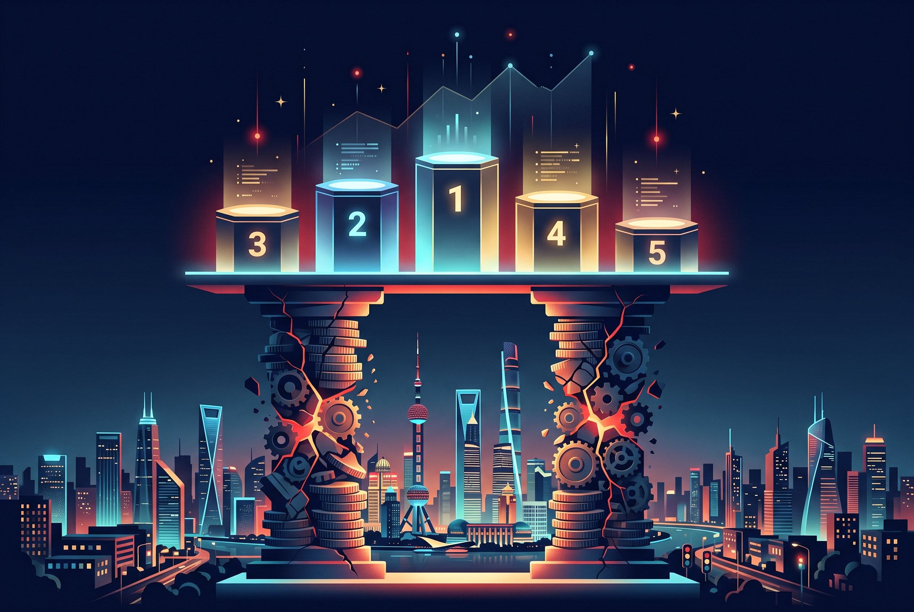

Mientras la conversación occidental se concentra en qué modelo puntúa más, un informe trimestral publicado hoy por Robonaissance junto a Inside China's Machine (vía TechFlow) se hace la pregunta incómoda: **¿cuánto cuestan estos modelos y quién está pagando la cuenta?** La respuesta, tras revisar los estados financieros de **19 vendors chinos**: ninguno puede demostrar que su negocio de modelos se sostenga solo. Las matrices tapan el hueco con otros negocios y los labs independientes viven de inversores.

## Quién banca la fiesta

El caso más ilustrativo es **Xiaomi**: de sus 18.200 millones de RMB de gasto semestral en I+D, cerca del **30% se fue en IA — unos 5.500 millones de RMB (≈ US$800 millones)** en seis meses, cubriendo desde modelos de lenguaje hasta todo su trabajo de IA. ¿De dónde sale esa plata? De teléfonos y autos eléctricos, no de vender tokens. En el mismo período, Zhipu (el lab cotizado en Hong Kong detrás de GLM) invirtió 2.130 millones de RMB en I+D total.

La conclusión del informe es seca: **ningún modelo grande chino ha logrado el break-even solo vendiendo APIs**. El cross-subsidio es el modelo de negocio dominante.

## Y aun así, arriba en el tablero

Lo irónico es que esta industria "que no gana plata" sigue subiendo en los rankings. Al 1 de octubre, los cinco modelos chinos top en el **Intelligence Index de Artificial Analysis** puntúan entre 44 y 46: **Xiaomi MiMo-V2.6-Pro (46)**, Alibaba Qwen3.8 Max, **Zhipu GLM-5.3 (45)**, Moonshot Kimi K3 (44) y StepFun Step 5 Preview.

Y el dato que explica por qué Reuters titula que *"un modelo chino barato está alcanzando a Anthropic y OpenAI en su propia cancha"*: el MiMo-V2.6-Pro, líder open-weights con 46 (empatando a Grok 4.7), cuesta **~US$0,13 por tarea completada** según Artificial Analysis — contra **US$2,01 de GLM-5.3** y **US$2,00 de Kimi K3** en configuración de razonamiento máximo. La diferencia: MiMo tarda más por tarea (~19,5 min vs ~10,7 min de GLM-5.3), pero a esa diferencia de precio, el throughput por dólar no tiene competencia en la frontera cerrada.

Ya lo vimos cuando Xiaomi liberó MiMo con licencia MIT y un stack de RL de más de 7.000 entornos: la estrategia china no es solo perseguir el benchmark, es **demoler el precio** mientras lo hace.

## El takeaway para quien elige modelos

Dos lecturas prácticas:

- **Para equipos técnicos**: el precio/rendimiento de los modelos abiertos chinos sigue siendo imbatible; MiMo, GLM y Kimi son hoy opciones de primera línea en cualquier stack de agentes.
- **Para quien mira el largo plazo**: un ecosistema que compite al nivel de frontera sin ingresos sostenibles de APIs es un ecosistema subsidiado. Cuando el informe muestra que todos pierden plata, la consolidación no es una posibilidad — es una cita pendiente.

**Fuentes:** [TechFlow — From Xiaomi to Zhipu: Q3 2026 Profitability Landscape](https://www.techflowpost.com/en-US/article/34358), [Artificial Analysis](https://artificialanalysis.ai/), Reuters.
