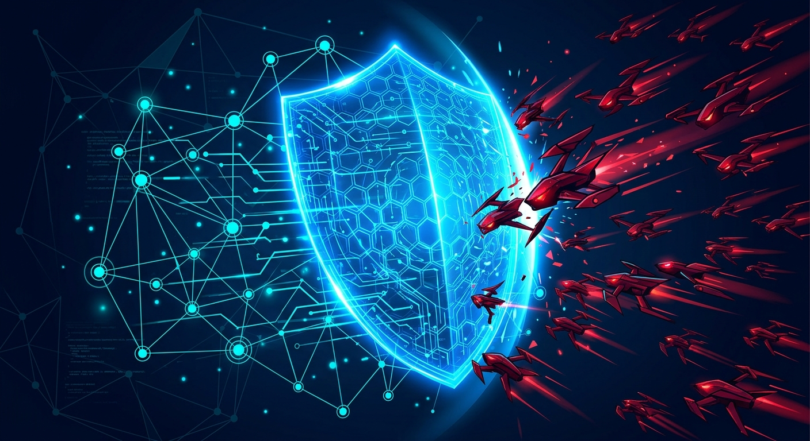

Nada de tono futurista ni escenarios hipotéticos: el [Digital Defense Report 2026](https://www.microsoft.com/en-us/security/blog/2026/10/01/insights-from-the-2026-microsoft-digital-defense-report/) de Microsoft, publicado esta semana y basado en el análisis de **165 billones de señales de seguridad diarias** (trillion, en inglés), llega a una conclusión bastante incómoda: **la IA ya corrió el cerco y, en el corto plazo, la ventaja es de los atacantes**.

## Los números que duelen

El informe cubre julio 2025 a junio 2026, y lo que documenta no es una tendencia emergente sino una realidad instalada:

- **El tiempo mediano entre el descubrimiento de una vulnerabilidad y su weaponización cayó a menos de 24 horas**. O sea: el patch window clásico ya no existe. Si tu ciclo de despliegue semanal era "aceptable", dejó de serlo.
- **Cerca de 40.000 CVEs publicados solo en el primer semestre de 2026**, con el año en camino a **prácticamente duplicar** el récord anterior. Y eso cuenta solo lo reportado públicamente.
- **Partes de la cadena de ataque se comprimieron de días a minutos o segundos**, gracias a IA que reduce el tiempo, la expertise y el costo de operar.
- **El ransomware autónomo ya hackeó organizaciones reales**. Microsoft es explícito: no lo trata como amenaza futura, lo trata como algo que ya llegó.

## El detalle que más debería incomodar a los equipos de plataforma

Entre los escenarios que el reporte marca como factibles con tecnología actual: **gusanos autónomos que usan claves de proveedores LLM robadas para mejorarse a sí mismos** — investigar, corregir sus propios errores y adaptarse en cada iteración. Traducción para DevOps: **las API keys de tus servicios de IA son el nuevo secreto crítico**, al mismo nivel que credenciales de cloud. Si aún las tienes tiradas en variables de entorno sin rotación, este es el momento de arreglarlo.

A eso se suma el daño silencioso: **el contenido sintético generado por IA está erosionando la confianza en las comunicaciones digitales** en general, con el phishing por voz y la suplantación de helpdesk como vectores en franca expansión.

## La paradoja de la defensa

Irónico, porque la misma IA que acelera a los atacantes también ayuda a los defensores: el análisis de código asistido por modelos está haciendo posible examinar software y encontrar debilidades a una escala que antes era impensable. El problema es de velocidad de adopción: **los atacantes capturan el valor de la IA más rápido que las defensas empresariales promedio**.

## El punto para el blog

Para los que operamos infra: esto convierte cosas que eran "buenas prácticas" en requisitos de supervivencia. Despliegue continuo real (no quincenal), gestión automática de vulnerabilidades, rotación de secretos incluidas las keys de IA, y hardening del perímetro humano (helpdesk, verificación de identidad). La ventana de reacción dejó de medirse en semanas. Ahora se mide en horas, y para algunas cadenas de ataque, en minutos.

El informe completo está [acá](https://www.microsoft.com/en-us/corporate-responsibility/topics/cybersecurity/reports/microsoft-digital-defense-report/), y vale la pena leerlo entero antes de que tu próximo ticket de "actualizar dependencias críticas" siga sentado en el backlog.
