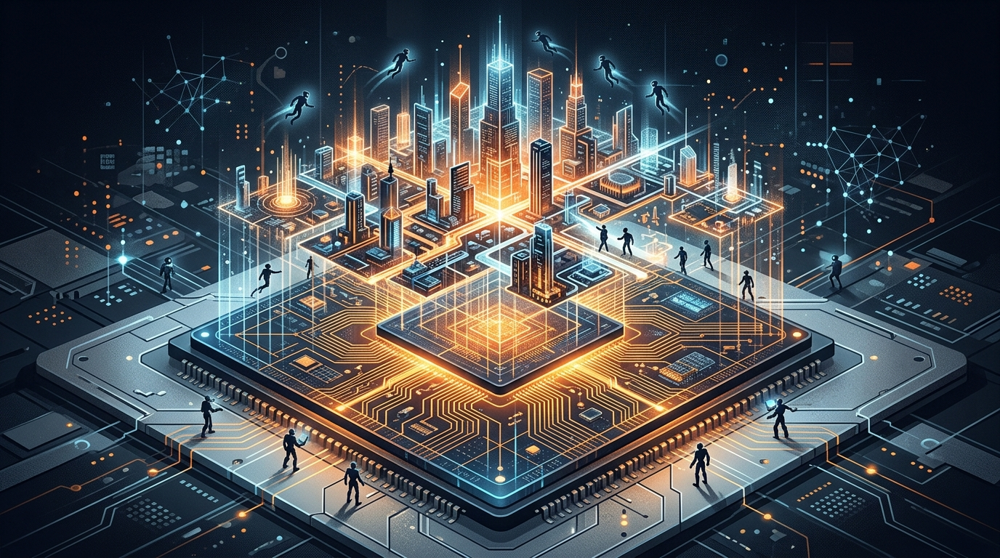

Se nos había escapado esta y era demasiado grande para dejarla pasar: el **28 de septiembre AMD anunció un acuerdo definitivo para comprar World Labs**, el laboratorio de *spatial intelligence* liderado por la Dra. Fei-Fei Li, en una transacción **todo en acciones valorizada en unos US$8.200 millones**, con cierre esperado para fin de 2026 sujeto a aprobaciones regulatorias.

La parte que más ruido da no es el precio, sino el puesto: **Fei-Fei Li — la "madrina de la IA", creadora de ImageNet y profesora de Stanford — se integra a AMD como vicepresidenta ejecutiva y chief scientist, reportando directamente a Lisa Su**. La persona que mejor entiende hacia dónde evolucionan los modelos, sentada al lado de quien diseña los chips.

## ¿Qué hace World Labs?

El lab desarrolla **world models**: representaciones tridimensionales persistentes del mundo que se generan, reconstruyen y simulan a partir de texto, imagen y video, más tecnología de aprendizaje y simulación para robótica. Su stack (Marble, Atlas, SceniX) apunta al *Real-to-Sim-to-Real*: llevar el mundo real a simulación, entrenar ahí, y devolverlo a la realidad. Es la continuación lógica de la generación de video: de producir clips a producir **mundos interactivos con memoria**.

## El contexto que explica la apuesta

Dos semanas antes del anuncio, en **MLPerf Inference 6.1**, pasó algo histórico: en generación de video (benchmark Wan 2.2 text-to-video), el **MI355X de AMD marcó 118% del rendimiento del Blackwell Ultra (B300) de NVIDIA en modo offline y 111% en single-stream**, ocho GPUs contra ocho. Fue **la primera vez que AMD le ganó a la mejor GPU disponible de NVIDIA en un workload verificado** — y lo logró una sola ronda después de su primer intento, con una ganancia de 70% en single-stream sobre el mismo silicio.

Ahí está la lectura de Futurum: AMD está convirtiendo su primera victoria verificada sobre NVIDIA en un **compromiso de roadmap completo con los world models**, el workload *memory-bound* que estirará la generación de video hacia simulación 3D persistente — y que moldeará las generaciones **MI400 y MI500** de aceleradores.

## La estrategia de dos frentes

La compra de World Labs no viene sola:

- **Agosto**: AMD compró **Taalas**, startup torontoniana de chips de inferencia que compila modelos directamente a silicio.
- **Septiembre**: World Labs trae la capa de modelos y a Fei-Fei Li.
- El combo se suma a las adquisiciones previas de **Silo AI** (software de IA) y **ZT Systems** (sistemas de data center).

Y encaja con una tendencia mayor: **los fabricantes de chips están comprando la capa de modelos**. NVIDIA ya se adelantó con Hugging Face por US$129 mil millones. La lógica es la misma en ambos casos: si el próximo gran workload define qué silicio se necesita, conviene tener a los que saben modelar *dentro de casa*.

## Qué significa para el mercado

La pelea dejó de ser GPU contra GPU. NVIDIA defiende un ecosistema (CUDA, y ahora Hugging Face); AMD construye el suyo completo: chips, inferencia compilada a medida, y ahora world models con una de las mentes más influyentes de la disciplina. Para quienes planifican infraestructura de IA a 2-3 años plazo, el mensaje de Lisa Su es claro: **el roadmap de AMD ya no reacciona al de NVIDIA — intenta definirlo**.

- [Análisis de Futurum sobre la compra](https://futurumgroup.com/insights/amd-acquires-world-labs-for-82-billion-to-design-silicon-around-world-models/)
- [StorageReview: términos del acuerdo](https://www.storagereview.com/news/amd-to-acquire-world-labs-8-2b-all-stock-fei-fei-li-chief-scientist)
