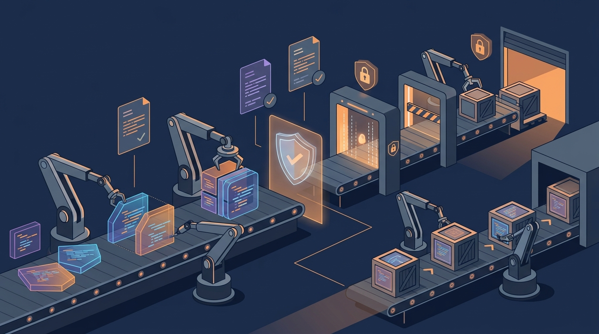

GitLab salió hoy con un anuncio grande y con nombre de tesis: la **"governed software factory"**, una fábrica de software gobernada. La idea es simple de enunciar y compleja de ejecutar: mover software desde la idea hasta producción dentro de un sistema conectado, bajo las políticas de la propia organización, y no en la torre de herramientas sueltas que la mayoría usa hoy.

## El diagnóstico: todos tenemos una fábrica en la sombra

Según GitLab, la mayoría de las empresas opera una **"shadow software factory"**: herramientas separadas para código, issues, SCM, CI/CD, seguridad, artefactos y deploy. Sin identidad compartida, sin política común y sin registro de cómo se hizo cada cambio. Eso ya era malo con humanos; con agentes de IA publicando paquetes a velocidad de máquina, se vuelve insostenible.

Los números que aporta GitLab para justificar el urgency: más de **70 millones de developers** y 10.000 empresas en la plataforma, y en los últimos tres meses los usuarios activos de desarrollo agéntico crecieron **200% a año corrido**, los repositorios seguros +100%, los namespaces +80% y los pipelines de CI/CD +40%.

## Lo que anunció, en concreto

- **`/goal` en Duo Agent Platform y GitLab for Slack**: flujos dirigidos por objetivo que eliminan las esperas entre handoffs (review, tests, checks de seguridad, aprobaciones, deploy). Disponible en Duo CLI, modo headless, Agentic Chat y Slack, bajo la misma identidad y política.
- **GitLab Artifact Central** (beta en GitLab.com, self-managed este mes): contenedores y paquetes en un solo plano de control junto al código y la CI. Política definida una vez a nivel de organización y, según GitLab, hasta 50% menos TCO que la alternativa.
- **GitLab Dependency Firewall** (early access): cada paquete se revisa contra política antes de entrar al build. Advierte, bloquea o pone en cuarentena según antigüedad del paquete, severidad de vulnerabilidades, detección de paquetes maliciosos y cumplimiento de licencias.
- **Secrets Manager llega a GA**: disponible en GitLab.com y en self-managed con el release 19.5. Secretos scoped por job, permisos de grupo/proyecto existentes, todo en el audit trail, revocación de credencial filtrada en un clic y hasta 50% de ahorro versus mantener un vault aparte.
- **Claude Mythos 5 y 5.1 de Anthropic** llegan el próximo mes a los flujos de seguridad del Duo Agent Platform, para encontrar y remediar vulnerabilidades antes que los atacantes las exploten.
- **GitLab Security Standard** (disponible hoy): cinco controles para la era agéntica, con una métrica central elegante — **tiempo desde detección hasta remediación verificada**.

## El ángulo de costos (que es el que va a doler)

El anuncio también ataca el problema presupuestario de la IA: **Impact Analytics** (early access) muestra costo e impacto de la inversión en IA por equipo, tarea y modelo, complementando los caps de gasto recién introducidos (por suscripción, grupo o usuario).

Y el dato que más llama la atención: **GitLab Orbit**, el mapa del ciclo de vida para agentes, ya lo usan más de 3.500 organizaciones desde su beta de junio y ha respondido 280.000+ consultas de agentes de código. Con ese contexto, GitLab reporta hasta **45x menos retries y 4,5x menos tokens** por tarea. Orbit llega a GA el próximo mes.

## La cita

> "Toda empresa ya opera una fábrica de software, pero pocas han diseñado intencionalmente los sistemas y controles que la gobiernan", dijo Manav Khurana, CPO de GitLab. La traducción libre: los agentes no van a esperar a que llegues con governance, así que más te vale ponerle barandas ahora.

## Mi lectura

La movida es coherente con hacia dónde va el mercado: el cuello de botella del desarrollo agéntico ya no es generar código, es **controlar lo que ese código arrastra consigo** — dependencias, credenciales y evidencia de qué hizo cada cambio. La propuesta de una sola plataforma con identidad y política compartidas es el argumento de siempre de GitLab, pero ahora con un enemigo nuevo y muy real: agentes sueltos en la supply chain.

Si el 45x menos retries de Orbit se sostiene en producción, el pitch económico se defiende solo. La duda clásica permanece: ¿cuánta de esta suite queda en beta/early access por meses? Por ahora: Artifact Central en beta, Dependency Firewall e Impact Analytics en early access, Mythos "el próximo mes". La fábrica gobernada existe, pero está en construcción.

**Fuente:** [GitLab — Announces the Foundation for the Governed Software Factory (Business Wire)](https://www.businesswire.com/news/home/20261006057924/en/)
