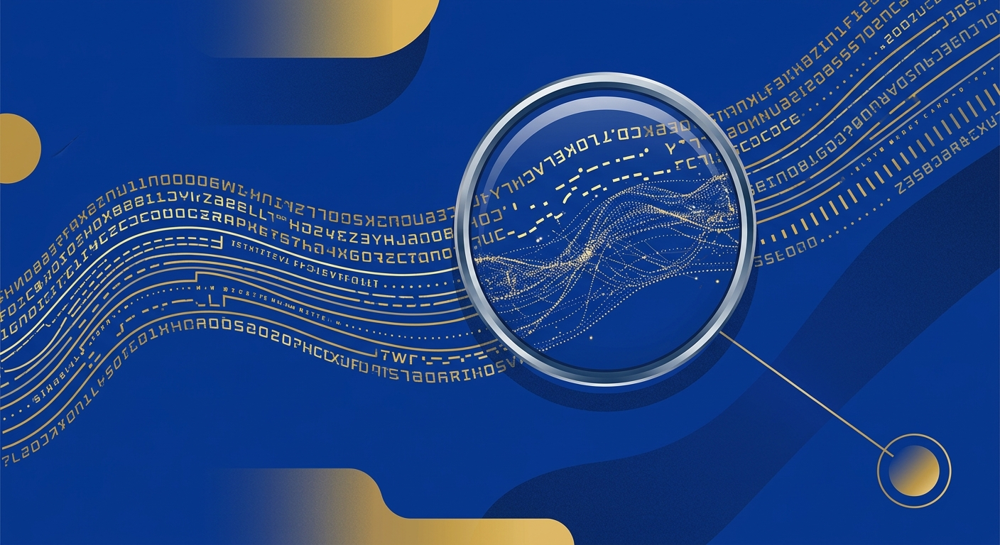

OpenAI anunció que empezará a agregar un **watermark invisible** al texto generado por ChatGPT y Codex en la Unión Europea, para cumplir las reglas de transparencia del **EU AI Act** que entraron en vigor el 2 de agosto. El sistema se llama **textGrain** y viene con reporte técnico incluido, co-escrito con investigadores de UPenn y Yale. La movida llega dos meses después de que Anthropic anunciara su propio watermarking global para Claude (que ya cubrimos acá).

## Qué se anunció exactamente

- **ChatGPT y Codex en la UE**: el watermark se activa progresivamente en las próximas semanas para usuarios elegibles de todos los planes, solo dentro de la Unión Europea.
- **API**: disponible desde ya para desarrolladores de todo el mundo en modelos seleccionados, pero **desactivada por defecto**.
- **No es default global (todavía)**: OpenAI aclara explícitamente que no está haciendo del watermark de texto un estándar mundial al lanzamiento.

## Cómo funciona textGrain

No es un símbolo ni metadata: el watermark **moldea sutilmente las elecciones de palabras del modelo**, dejando un patrón estadístico que el lector no ve pero un detector sí. Al vivir en las palabras mismas, **sobrevive el copy-paste**. OpenAI señala que no identifica al usuario y que no vio cambios significativos en el rendimiento de los modelos con el watermark activado.

La técnica usa una **clave secreta** para ordenar las predicciones de siguiente palabra. Cientos de estos "nudges" acumulados permiten al detector identificar contenido generado usando solo el texto y la clave.

## Las limitaciones (que OpenAI reconoce sin anestesia)

- En un test, **reemplazar solo 10% de las palabras con sinónimos bajó la detección de ~92% a 66%**.
- Pasajes cortos, respuestas matemáticas y texto traducido son más difíciles de detectar.
- La ausencia de watermark **no prueba autoría humana**: el texto puede ser muy corto, muy editado, o venir del modelo de otra empresa.

Por eso, el acceso inicial al detector queda limitado a **investigadores aprobados y organizaciones expertas** que ayuden a evaluar su confiabilidad.

## Contexto que importa

OpenAI tenía un watermark de texto construido desde 2024, pero no lo lanzó en parte por miedo a que los usuarios migraran a rivales sin watermark (lo reportó el WSJ en su momento). Que hoy lo active —empujado por regulación— dice bastante: la transparencia impuesta por el EU AI Act movió la aguja donde la competencia no pudo.

Anthropic, Google, Meta, Microsoft y OpenAI ya firmaron el **código de práctica de la UE** sobre contenido generado por IA. Con Anthropic marcando a nivel global desde agosto y OpenAI sumándose ahora en Europa, el watermarking de texto pasó de debate académico a feature estándar de la industria. La pregunta pendiente: ¿alguien más sigue, o queda como cartel de "mis outputs son detectables"?
